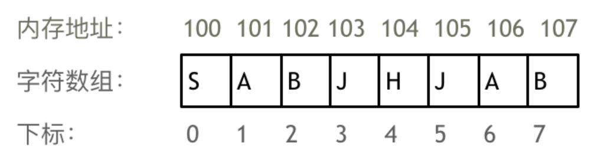
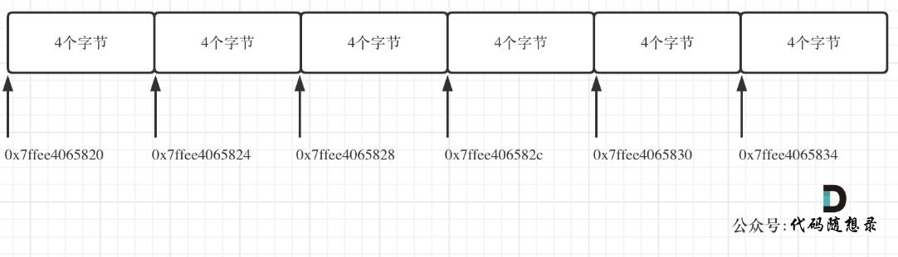

**1.数组是存放在连续内存空间上的相同类型数据的集合。**




**2.C++中，二维数组是连续分布的。**

测试代码：

```cpp
void test_arr() {
    int array[2][3] = {
		{0, 1, 2},
		{3, 4, 5}
    };
    cout << &array[0][0] << " " << &array[0][1] << " " << &array[0][2] << endl;
    cout << &array[1][0] << " " << &array[1][1] << " " << &array[1][2] << endl;
}

int main() {
    test_arr();
}
```

结果：

```text
0x7ffee4065820 0x7ffee4065824 0x7ffee4065828
0x7ffee406582c 0x7ffee4065830 0x7ffee4065834
```


