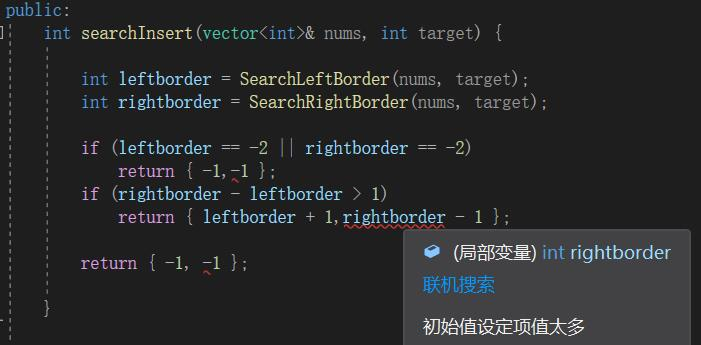

**力扣（34）：**

给你一个按照非递减顺序排列的整数数组 `nums`，和一个目标值 `target`。请你找出给定目标值在数组中的开始位置和结束位置。

如果数组中不存在目标值 `target`，返回 `[-1, -1]`。

你必须设计并实现时间复杂度为 `O(log n)` 的算法解决此问题。

**示例 1：**

```
输入：nums = [5,7,7,8,8,10], target = 8
输出：[3,4]
```

**示例 2：**

```
输入：nums = [5,7,7,8,8,10], target = 6
输出：[-1,-1]
```

**示例 3：**

```
输入：nums = [], target = 0
输出：[-1,-1]
```

**提示：**

- `0 <= nums.length <= 105`
- `-109 <= nums[i] <= 109`
- `nums` 是一个非递减数组
- `-109 <= target <= 109


这道题我没有写出来，想不出怎么查找左边界和右边界下标。先贴下写好的，这是边看解答边思考边写的（已经差不多算抄了）

```cpp
class Solution {
public:
    vector<int> searchRange(vector<int>& nums, int target) {
        int leftborder = SearchLeftBorder(nums, target);
        int rightborder = SearchRightBorder(nums, target);

        if (leftborder == -2 || rightborder == -2)
            return { -1,-1 };
        if (rightborder - leftborder > 1)
            return { leftborder + 1,rightborder - 1 };

        return { -1, -1 };
    }

private:
    int SearchRightBorder(vector<int>& nums, int target)
    {
        int left = 0, right = nums.size() - 1, rightborder = -2;
        while (left <= right)
        {
            int middle = left + (right - left) / 2;

            if (nums[middle] > target)
                right = middle - 1;
            else
            {
                left = middle + 1;
                rightborder = left;
            }
        }

        return rightborder;
    }

    int SearchLeftBorder(vector<int>& nums, int target)
    {
        int left = 0, right = nums.size() - 1, leftborder = -2;
        while (left <= right)
        {
            int middle = left + (right - left) / 2;

            if (nums[middle] < target)
            {
                left = middle + 1;
            }
            else
            {
                right = middle - 1;
                leftborder = right;
            }
        }
        return leftborder;
    }
};
```

再放上解答里带有解析的：

寻找target在数组里的左右边界，有如下三种情况：

- 情况一：target 在数组范围的右边或者左边，例如数组{3, 4, 5}，target为2或者数组{3, 4, 5},target为6，此时应该返回{-1, -1}
- 情况二：target 在数组范围中，且数组中不存在target，例如数组{3,6,7},target为5，此时应该返回{-1, -1}
- 情况三：target 在数组范围中，且数组中存在target，例如数组{3,6,7},target为6，此时应该返回{1, 1}

这三种情况都考虑到，说明就想的很清楚了。

接下来，在去寻找左边界，和右边界了。

采用二分法来去寻找左右边界，为了让代码清晰，我分别写两个二分来寻找左边界和右边界。

**寻找右边界：**确定好：计算出来的右边界是不包含target的右边界，左边界同理。

```cpp
// 二分查找，寻找target的右边界（不包括target）
// 如果rightBorder为没有被赋值（即target在数组范围的左边，例如数组[3,3]，target为2），为了处理情况一
int getRightBorder(vector<int>& nums, int target) {
    int left = 0;
    int right = nums.size() - 1; // 定义target在左闭右闭的区间里，[left, right]
    int rightBorder = -2; // 记录一下rightBorder没有被赋值的情况
    while (left <= right) { // 当left==right，区间[left, right]依然有效
        int middle = left + ((right - left) / 2);// 防止溢出 等同于(left + right)/2
        if (nums[middle] > target) {
            right = middle - 1; // target 在左区间，所以[left, middle - 1]
        } else { // 当nums[middle] == target的时候，更新left，这样才能得到target的右边界
            left = middle + 1;
            rightBorder = left;
        }
    }
    return rightBorder;
}
```

**寻找左边界：**

```cpp
// 二分查找，寻找target的左边界leftBorder（不包括target）
// 如果leftBorder没有被赋值（即target在数组范围的右边，例如数组[3,3],target为4），为了处理情况一
int getLeftBorder(vector<int>& nums, int target) {
    int left = 0;
    int right = nums.size() - 1; // 定义target在左闭右闭的区间里，[left, right]
    int leftBorder = -2; // 记录一下leftBorder没有被赋值的情况
    while (left <= right) {
        int middle = left + ((right - left) / 2);
        if (nums[middle] >= target) { // 寻找左边界，就要在nums[middle] == target的时候更新right
            right = middle - 1;
            leftBorder = right;
        } else {
            left = middle + 1;
        }
    }
    return leftBorder;
}
```

**整合：**

```cpp
class Solution {
public:
    vector<int> searchRange(vector<int>& nums, int target) {
        int leftBorder = getLeftBorder(nums, target);
        int rightBorder = getRightBorder(nums, target);
        // 情况一
        if (leftBorder == -2 || rightBorder == -2) return {-1, -1};
        // 情况三
        if (rightBorder - leftBorder > 1) return {leftBorder + 1, rightBorder - 1};
        // 情况二
        return {-1, -1};
    }
private:
     int getRightBorder(vector<int>& nums, int target) {
        int left = 0;
        int right = nums.size() - 1;
        int rightBorder = -2; // 记录一下rightBorder没有被赋值的情况
        while (left <= right) {
            int middle = left + ((right - left) / 2);
            if (nums[middle] > target) {
                right = middle - 1;
            } else { // 寻找右边界，nums[middle] == target的时候更新left
                left = middle + 1;
                rightBorder = left;
            }
        }
        return rightBorder;
    }
    int getLeftBorder(vector<int>& nums, int target) {
        int left = 0;
        int right = nums.size() - 1;
        int leftBorder = -2; // 记录一下leftBorder没有被赋值的情况
        while (left <= right) {
            int middle = left + ((right - left) / 2);
            if (nums[middle] >= target) { // 寻找左边界，nums[middle] == target的时候更新right
                right = middle - 1;
                leftBorder = right;
            } else {
                left = middle + 1;
            }
        }
        return leftBorder;
    }
};
```

总结：

虽然主要还是考察二分法的使用，但是我没想出来是这样找出两个边界。看过解答后明白了，之后就看自己能把这思路记多久了。


PS：在Visual Studio里，下面这段会报错：初始值设定项值太多。但是在力扣提交可以通过，这里没搞明白。



