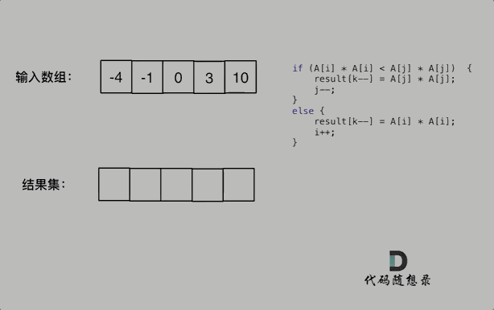

**力扣（977）：**

给你一个按 **非递减顺序** 排序的整数数组 `nums`，返回 **每个数字的平方** 组成的新数组，要求也按 **非递减顺序** 排序。

**示例 1：**

```
输入：nums = [-4,-1,0,3,10]
输出：[0,1,9,16,100]
解释：平方后，数组变为 [16,1,0,9,100]
排序后，数组变为 [0,1,9,16,100]
```

**示例 2：**

```
输入：nums = [-7,-3,2,3,11]
输出：[4,9,9,49,121]
```

**提示：**

- `1 <= nums.length <= 104`
- `-104 <= nums[i] <= 104`
- `nums` 已按 **非递减顺序** 排序


**自己写的：**

```cpp
class Solution {
public:
    vector<int> sortedSquares(vector<int>& nums) {
        vector<int>result;
        
        for (int i = 0; i < nums.size(); ++i)
        {
            result.push_back(nums[i] * nums[i]);
        }

        for (int i = 0; i < result.size() - 1; ++i)
        {
            int temp;
            for (int j = 0; j < result.size() - i - 1; ++j)
            {
                if (result[j] > result[j + 1])
                {
                    temp = result[j];
                    result[j] = result[j + 1];
                    result[j + 1] = temp;
                }
            }
        }
        return result;
    }
};
```

没想到什么好的排序方法，不如复习一下冒泡排序了


**教学上的：**

数组其实是有序的， 只不过负数平方之后可能成为最大数了。

那么数组平方的最大值就在数组的两端，不是最左边就是最右边，不可能是中间。

此时可以考虑双指针法了，i指向起始位置，j指向终止位置。

定义一个新数组result，和A数组一样的大小，让k指向result数组终止位置。

如果`A[i] * A[i] < A[j] * A[j]` 那么`result[k--] = A[j] * A[j];` 。

如果`A[i] * A[i] >= A[j] * A[j]` 那么`result[k--] = A[i] * A[i];` 。

如动画所示：



```
class Solution {
public:
    vector<int> sortedSquares(vector<int>& A) {
        int k = A.size() - 1;
        vector<int> result(A.size(), 0);
        for (int i = 0, j = A.size() - 1; i <= j;) { //注意这里要i <= j，因为最后要处理两个元素
            if (A[i] * A[i] < A[j] * A[j])  {
                result[k--] = A[j] * A[j];
                j--;
            }
            else {
                result[k--] = A[i] * A[i];
                i++;
            }
        }
        return result;
    }
};
```


# **总结：**

这道题也没什么，记住这种情况下的排序思路就行

但是这里记录一下写这道题时我的问题：

1.对各种排序算法不熟悉

2.不知道怎么计算时间复杂度

这些问题希望自己能尽快解决。


补充：马上去看了点视频补了下基础的，先放上这张图，应该会很有用

