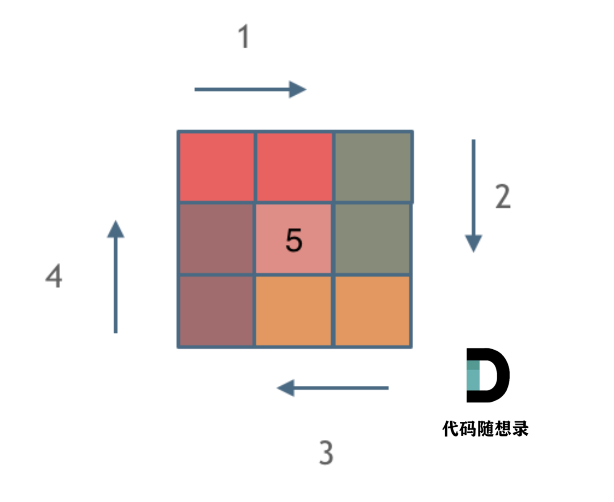

**力扣（59）：**

给你一个正整数 `n` ，生成一个包含 `1` 到 `n2` 所有元素，且元素按顺时针顺序螺旋排列的 `n x n` 正方形矩阵 `matrix` 。

**示例 1：**


```
输入：n = 3
输出：[[1,2,3],[8,9,4],[7,6,5]]
```

**示例 2：**

```
输入：n = 1
输出：[[1]]
```

**提示：**

- `1 <= n <= 20`


经典题目，直接上教学：


坚持循环不变量原则。

模拟顺时针画矩阵的过程:

- 填充上行从左到右
- 填充右列从上到下
- 填充下行从右到左
- 填充左列从下到上

由外向内一圈一圈这么画下去。这里一圈下来，我们要画每四条边，这四条边怎么画，每画一条边都要坚持一致的左闭右开，或者左开右闭的原则，这样这一圈才能按照统一的规则画下来。按照左闭右开的原则，来画一圈：



每一种颜色，代表一条边，我们遍历的长度，可以看出每一个拐角处的处理规则，拐角处让给新的一条边来继续画。这也是坚持了每条边左闭右开的原则。

```cpp
class Solution {
public:
    vector<vector<int>> generateMatrix(int n) {
        vector<vector<int>> res(n, vector<int>(n, 0)); // 使用vector定义一个二维数组
        int startx = 0, starty = 0; // 定义每循环一个圈的起始位置
        int loop = n / 2; // 每个圈循环几次，例如n为奇数3，那么loop = 1 只是循环一圈，矩阵中间的值需要单独处理
        int mid = n / 2; // 矩阵中间的位置，例如：n为3， 中间的位置就是(1，1)，n为5，中间位置为(2, 2)
        int count = 1; // 用来给矩阵中每一个空格赋值
        int offset = 1; // 需要控制每一条边遍历的长度，每次循环右边界收缩一位
        int i,j;
        while (loop --) {
            i = startx;
            j = starty;

            // 下面开始的四个for就是模拟转了一圈
            // 模拟填充上行从左到右(左闭右开)
            for (j = starty; j < n - offset; j++) {
                res[startx][j] = count++;
            }
            // 模拟填充右列从上到下(左闭右开)
            for (i = startx; i < n - offset; i++) {
                res[i][j] = count++;
            }
            // 模拟填充下行从右到左(左闭右开)
            for (; j > starty; j--) {
                res[i][j] = count++;
            }
            // 模拟填充左列从下到上(左闭右开)
            for (; i > startx; i--) {
                res[i][j] = count++;
            }

            // 第二圈开始的时候，起始位置要各自加1， 例如：第一圈起始位置是(0, 0)，第二圈起始位置是(1, 1)
            startx++;
            starty++;

            // offset 控制每一圈里每一条边遍历的长度
            offset += 1;
        }

        // 如果n为奇数的话，需要单独给矩阵最中间的位置赋值
        if (n % 2) {
            res[mid][mid] = count;
        }
        return res;
    }
};
```

- 时间复杂度 O(n^2): 模拟遍历二维矩阵的时间
- 空间复杂度 O(1)


# **总结：**

经典题目，就按照教学上的要求，好好记住循环不变量原则就行

自己写的时候，遇到的问题就是粗心了，比如又犯了数组坐标写成  i, i  这种低级错误，以及转圈的时候，什么时候i++，j++，什么时候i--，j--，这些很容易一不注意就写错，所以一定要认真+细心。