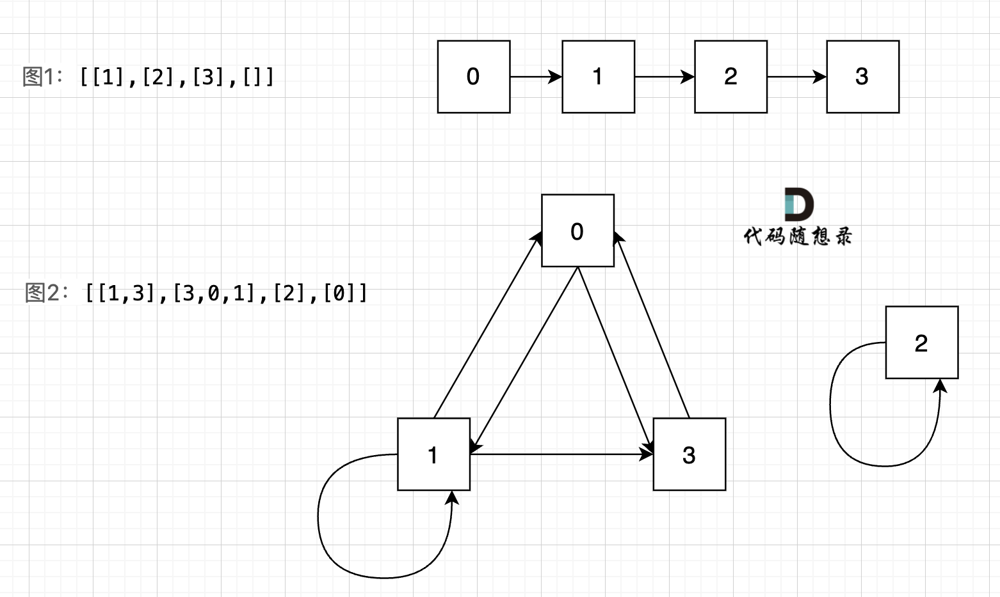

**力扣（841）：**

有 `n` 个房间，房间按从 `0` 到 `n - 1` 编号。最初，除 `0` 号房间外的其余所有房间都被锁住。你的目标是进入所有的房间。然而，你不能在没有获得钥匙的时候进入锁住的房间。

当你进入一个房间，你可能会在里面找到一套不同的钥匙，每把钥匙上都有对应的房间号，即表示钥匙可以打开的房间。你可以拿上所有钥匙去解锁其他房间。

给你一个数组 `rooms` 其中 `rooms[i]` 是你进入 `i` 号房间可以获得的钥匙集合。如果能进入 **所有** 房间返回 `true`，否则返回 `false`。

**示例 1：**

```
输入：rooms = [[1],[2],[3],[]]
输出：true
解释：
我们从 0 号房间开始，拿到钥匙 1。
之后我们去 1 号房间，拿到钥匙 2。
然后我们去 2 号房间，拿到钥匙 3。
最后我们去了 3 号房间。
由于我们能够进入每个房间，我们返回 true。
```

**示例 2：**

```
输入：rooms = [[1,3],[3,0,1],[2],[0]]
输出：false
解释：我们不能进入 2 号房间。
```

**提示：**

- `n == rooms.length`
- `2 <= n <= 1000`
- `0 <= rooms[i].length <= 1000`
- `1 <= sum(rooms[i].length) <= 3000`
- `0 <= rooms[i][j] < n`
- 所有 `rooms[i]` 的值 **互不相同**


自己写的：

```cpp
class Solution {
public:
    void dfs(const vector<vector<int>>& rooms, vector<bool>& isvisited, int key) {
        if (rooms[key].empty()) {
            isvisited[key] = true;
            return;
        }
        
        if (isvisited[key])
            return;

        isvisited[key] = true;
        for (int i = 0; i < rooms[key].size(); ++i) {
            dfs(rooms, isvisited, rooms[key][i]);
        }
    }

    bool canVisitAllRooms(vector<vector<int>>& rooms) {
        vector<bool> isvisited(rooms.size(), false);

        dfs(rooms, isvisited, 0);

        for (int i = 0; i < isvisited.size(); ++i) {
            if (!isvisited[i])
                return false;
        }

        return true;
    }
};
```

因为粗心浪费了很多时间


本题其实给我们是一个有向图， 意识到这是有向图很重要！

图中给我的两个示例： `[[1],[2],[3],[]]` `[[1,3],[3,0,1],[2],[0]]`，画成对应的图如下：



我们可以看出图1的所有节点都是链接的，而图二中，节点2 是孤立的。

这就很容易让我们想起岛屿问题，只要发现独立的岛，就是不能进入所有房间。

此时也容易想到用并查集的方式去解决。

**但本题是有向图**，在有向图中，即使所有节点都是链接的，但依然不可能从0出发遍历所有边。 给大家举一个例子：

图3：[[5], [], [1, 3], [5]] ，如图：


在图3中，大家可以发现，节点0只能到节点5，然后就哪也去不了了。

所以本题是一个有向图搜索全路径的问题。 只能用深搜（DFS）或者广搜（BFS）来搜。

**以下dfs分析 大家一定要仔细看，本题有两种dfs的解法，很多题解没有讲清楚**。 看完之后 相信你对dfs会有更深的理解。

深搜三部曲：

1.确认递归函数，参数

需要传入二维数组rooms来遍历地图，需要知道当前我们拿到的key，以至于去下一个房间。

同时还需要一个数组，用来记录我们都走过了哪些房间，这样好知道最后有没有把所有房间都遍历的，可以定义一个一维数组。

所以 递归函数参数如下：

```text
// key 当前得到的可以 
// visited 记录访问过的房间 
void dfs(const vector<vector<int>>& rooms, int key, vector<bool>& visited) {
```

2.确认终止条件

遍历的时候，什么时候终止呢？

这里有一个很重要的逻辑，就是在递归中，**我们是处理当前访问的节点，还是处理下一个要访问的节点**。

这决定 终止条件怎么写。

首先明确，本题中什么叫做处理，就是 visited数组来记录访问过的节点，该节点默认 数组里元素都是false，把元素标记为true就是处理 本节点了。

如果我们是处理当前访问的节点，当前访问的节点如果是 true ，说明是访问过的节点，那就终止本层递归，如果不是true，我们就把它赋值为true，因为这是我们处理本层递归的节点。

代码就是这样：

```text
// 写法一：处理当前访问的节点
void dfs(const vector<vector<int>>& rooms, int key, vector<bool>& visited) {
    if (visited[key]) { // 本层递归是true，说明访问过，立刻返回
        return;
    }
    visited[key] = true; // 给当前遍历的节点赋值true 
    vector<int> keys = rooms[key];
    for (int key : keys) {
        // 深度优先搜索遍历
        dfs(rooms, key, visited);
    }
}
```

如果我们是处理下一层访问的节点，而不是当前层。那么就要在 深搜三部曲中第三步：处理目前搜索节点出发的路径的时候对 节点进行处理。

这样的话，就不需要终止条件，而是在 搜索下一个节点的时候，直接判断 下一个节点是否是我们要搜的节点。

代码就是这样的：

```text
// 写法二：处理下一个要访问的节点
void dfs(const vector<vector<int>>& rooms, int key, vector<bool>& visited) {
    // 这里 没有终止条件，而是在 处理下一层节点的时候来判断
    vector<int> keys = rooms[key];
    for (int key : keys) { 
        if (visited[key] == false) { // 处理下一层节点，判断是否要进行递归
            visited[key] = true;
            dfs(rooms, key, visited);
        }       
    }
}
```

可以看出，如果看待 我们要访问的节点，直接决定了两种不一样的写法，很多录友对这一块很模糊，可能做过这道题，但没有思考到这个维度上。

3.处理目前搜索节点出发的路径

其实在上面，深搜三部曲 第二部，就已经讲了，因为终止条件的两种写法， 直接决定了两种不一样的递归写法。

这里还有细节：

看上面两个版本的写法中， 好像没有发现回溯的逻辑。

我们都知道，有递归就有回溯，回溯就在递归函数的下面， 那么之前我们做的dfs题目，都需要回溯操作，例如：[797.所有可能的路径 ](https://programmercarl.com/0797.所有可能的路径.html)， **为什么本题就没有回溯呢？**

代码中可以看到dfs函数下面并没有回溯的操作。

此时就要在思考本题的要求了，本题是需要判断 0节点是否能到所有节点，那么我们就没有必要回溯去撤销操作了，只要遍历过的节点一律都标记上。

**那什么时候需要回溯操作呢？**

当我们需要搜索一条可行路径的时候，就需要回溯操作了，因为没有回溯，就没法“调头”， 如果不理解的话，去看我写的 [797.所有可能的路径 ](https://programmercarl.com/0797.所有可能的路径.html)的题解。

以上分析完毕，DFS整体实现C++代码如下：

```cpp
// 写法一：处理当前访问的节点
class Solution {
private:
    void dfs(const vector<vector<int>>& rooms, int key, vector<bool>& visited) {
        if (visited[key]) {
            return;
        }
        visited[key] = true;
        vector<int> keys = rooms[key];
        for (int key : keys) {
            // 深度优先搜索遍历
            dfs(rooms, key, visited);
        }
    }
public:
    bool canVisitAllRooms(vector<vector<int>>& rooms) {
        vector<bool> visited(rooms.size(), false);
        dfs(rooms, 0, visited);
        //检查是否都访问到了
        for (int i : visited) {
            if (i == false) return false;
        }
        return true;
    }
};
```

```cpp
写法二：处理下一个要访问的节点
class Solution {
private:  
    void dfs(const vector<vector<int>>& rooms, int key, vector<bool>& visited) {
        vector<int> keys = rooms[key];
        for (int key : keys) { 
            if (visited[key] == false) {
                visited[key] = true;
                dfs(rooms, key, visited);
            }       
        }
    }
public:
    bool canVisitAllRooms(vector<vector<int>>& rooms) {
        vector<bool> visited(rooms.size(), false); 
        visited[0] = true; // 0 节点是出发节点，一定被访问过
        dfs(rooms, 0, visited);  
        //检查是否都访问到了
        for (int i : visited) {
            if (i == false) return false;
        }
        return true;
    }
};
```

本题我也给出 BFS C++代码，代码如下：

```cpp
class Solution {
bool bfs(const vector<vector<int>>& rooms) {
    vector<int> visited(rooms.size(), 0); // 标记房间是否被访问过
    visited[0] = 1; //  0 号房间开始
    queue<int> que;
    que.push(0); //  0 号房间开始

    // 广度优先搜索的过程
    while (!que.empty()) {
        int key = que.front(); que.pop();
         vector<int> keys = rooms[key];
         for (int key : keys) {
             if (!visited[key]) {
                 que.push(key);
                 visited[key] = 1;
             }
         }
    }
    // 检查房间是不是都遍历过了
    for (int i : visited) {
        if (i == 0) return false;
    }
    return true;

}
public:
    bool canVisitAllRooms(vector<vector<int>>& rooms) {
        return bfs(rooms);
    }
};
```