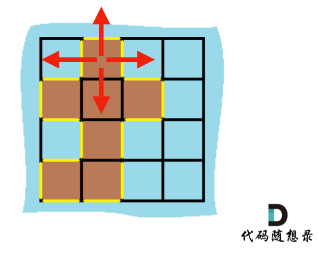
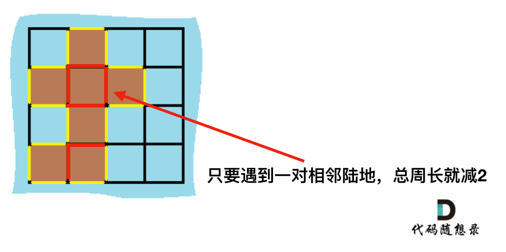

**力扣（463）：**

给定一个 `row x col` 的二维网格地图 `grid` ，其中：`grid[i][j] = 1` 表示陆地， `grid[i][j] = 0` 表示水域。

网格中的格子 **水平和垂直** 方向相连（对角线方向不相连）。整个网格被水完全包围，但其中恰好有一个岛屿（或者说，一个或多个表示陆地的格子相连组成的岛屿）。

岛屿中没有“湖”（“湖” 指水域在岛屿内部且不和岛屿周围的水相连）。格子是边长为 1 的正方形。网格为长方形，且宽度和高度均不超过 100 。计算这个岛屿的周长。

**示例 1：**


```
输入：grid = [[0,1,0,0],[1,1,1,0],[0,1,0,0],[1,1,0,0]]
输出：16
解释：它的周长是上面图片中的 16 个黄色的边
```

**示例 2：**

```
输入：grid = [[1]]
输出：4
```

**示例 3：**

```
输入：grid = [[1,0]]
输出：4
```

**提示：**

- `row == grid.length`
- `col == grid[i].length`
- `1 <= row, col <= 100`
- `grid[i][j]` 为 `0` 或 `1`


自己写的：

```cpp
class Solution {
public:
    int dir[4][2] = { {1,0},{0,1},{-1,0},{0,-1} };
    int perimeter;

    int neighbor(const vector<vector<bool>>& isvisited, int m, int n) {
        int cnt = 0;
        for (int i = 0; i < 4; ++i) {
            int neighm = m + dir[i][0];
            int neighn = n + dir[i][1];

            if (neighm < 0 || neighn < 0 || neighm >= isvisited.size() || neighn >= isvisited[0].size())
                continue;

            if (isvisited[neighm][neighn])
                cnt++;
        }

        return cnt;
    }

    void bfs(const vector<vector<int>>& grid, vector<vector<bool>>& isvisited, int m, int n) {
        if (isvisited[m][n])
            return;

        isvisited[m][n] = true;
        perimeter = 4;

        queue<pair<int, int>> que;
        que.push({ m,n });
        
        while (!que.empty()) {
            pair<int, int> node = que.front();
            que.pop();
            int nodem = node.first;
            int noden = node.second;
            for (int i = 0; i < 4; ++i) {
                int neighm = nodem + dir[i][0];
                int neighn = noden + dir[i][1];

                if (neighm < 0 || neighn < 0 || neighm >= isvisited.size() || neighn >= isvisited[0].size())
                    continue;

                if (!isvisited[neighm][neighn] && grid[neighm][neighn] == 1) {
                    isvisited[neighm][neighn] = 1;
                    que.push({ neighm,neighn });

                    int cnt = neighbor(isvisited, neighm, neighn);

                    if (cnt == 1)
                        perimeter += 2;
                    else if (cnt == 3)
                        perimeter -= 2;
                }
            }

        }
    }

    int islandPerimeter(vector<vector<int>>& grid) {
        int m = grid.size();
        int n = grid[0].size();

        vector<vector<bool>> isvisited(m, vector<bool>(n, false));

        perimeter = 0;
        for (int i = 0; i < m; ++i) {
            for (int j = 0; j < n; ++j) {
                if (!isvisited[i][j] && grid[i][j] == 1)
                    bfs(grid, isvisited, i, j);
            }
        }
        
        return perimeter;
    }
};
```

看完下面教学，感觉想这么多的我是个小丑


教学的：

岛屿问题最容易让人想到BFS或者DFS，但是这道题还真的没有必要，别把简单问题搞复杂了

### 解法一：

遍历每一个空格，遇到岛屿，计算其上下左右的情况，遇到水域或者出界的情况，就可以计算边了。

如图：



C++代码如下：（详细注释）

```cpp
class Solution {
public:
    int direction[4][2] = {0, 1, 1, 0, -1, 0, 0, -1};
    int islandPerimeter(vector<vector<int>>& grid) {
        int result = 0;
        for (int i = 0; i < grid.size(); i++) {
            for (int j = 0; j < grid[0].size(); j++) {
                if (grid[i][j] == 1) {
                    for (int k = 0; k < 4; k++) {       // 上下左右四个方向
                        int x = i + direction[k][0];
                        int y = j + direction[k][1];    // 计算周边坐标x,y
                        if (x < 0                       // i在边界上
                                || x >= grid.size()     // i在边界上
                                || y < 0                // j在边界上
                                || y >= grid[0].size()  // j在边界上
                                || grid[x][y] == 0) {   // x,y位置是水域
                            result++;
                        }
                    }
                }
            }
        }
        return result;
    }
};
```

### 解法二：

计算出总的岛屿数量，因为有一对相邻两个陆地，边的总数就减2，那么在计算出相邻岛屿的数量就可以了。

result = 岛屿数量 * 4 - cover * 2;

如图：



C++代码如下：（详细注释）

```cpp
class Solution {
public:
    int islandPerimeter(vector<vector<int>>& grid) {
        int sum = 0;    // 陆地数量
        int cover = 0;  // 相邻数量
        for (int i = 0; i < grid.size(); i++) {
            for (int j = 0; j < grid[0].size(); j++) {
                if (grid[i][j] == 1) {
                    sum++;
                    // 统计上边相邻陆地
                    if(i - 1 >= 0 && grid[i - 1][j] == 1) cover++;
                    // 统计左边相邻陆地
                    if(j - 1 >= 0 && grid[i][j - 1] == 1) cover++;
                    // 为什么没统计下边和右边？ 因为避免重复计算
                }
            }
        }
        return sum * 4 - cover * 2;
    }
};
```