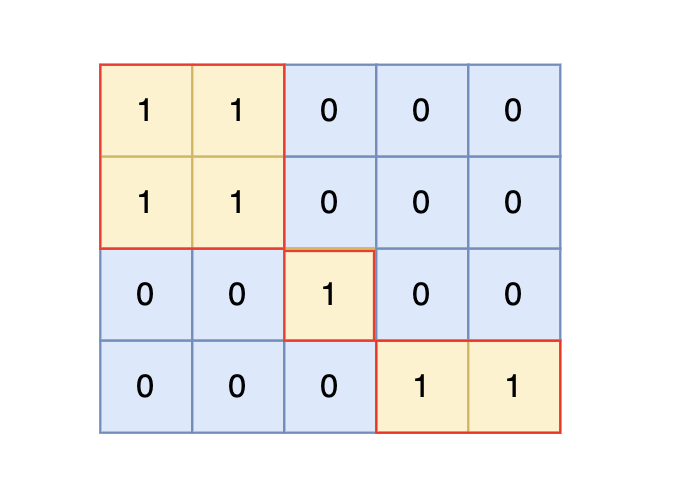

**卡码（99）：**

###### 题目描述

给定一个由 1（陆地）和 0（水）组成的矩阵，你需要计算岛屿的数量。岛屿由水平方向或垂直方向上相邻的陆地连接而成，并且四周都是水域。你可以假设矩阵外均被水包围。

###### 输入描述

第一行包含两个整数 N, M，表示矩阵的行数和列数。

后续 N 行，每行包含 M 个数字，数字为 1 或者 0。

###### 输出描述

输出一个整数，表示岛屿的数量。如果不存在岛屿，则输出 0。

###### 输入示例

```
4 5
1 1 0 0 0
1 1 0 0 0
0 0 1 0 0
0 0 0 1 1
```

###### 输出示例

```
3
```

###### 提示信息



根据测试案例中所展示，岛屿数量共有 3 个，所以输出 3。

**数据范围：**

1 <= N, M <= 50


注意题目中每座岛屿只能由**水平方向和/或竖直方向上**相邻的陆地连接形成。

也就是说斜角度链接是不算了， 例如示例二，是三个岛屿，如图：


这道题题目是 DFS，BFS，并查集，基础题目。

本题思路，是用遇到一个没有遍历过的节点陆地，计数器就加一，然后把该节点陆地所能遍历到的陆地都标记上。

在遇到标记过的陆地节点和海洋节点的时候直接跳过。 这样计数器就是最终岛屿的数量。

那么如何把节点陆地所能遍历到的陆地都标记上呢，就可以使用 DFS，BFS或者并查集


### 深度优先搜索

以下代码使用dfs实现，C++代码如下：

```cpp
// 版本一 
#include <iostream>
#include <vector>
using namespace std;

int dir[4][2] = {0, 1, 1, 0, -1, 0, 0, -1}; // 四个方向
void dfs(const vector<vector<int>>& grid, vector<vector<bool>>& visited, int x, int y) {
    for (int i = 0; i < 4; i++) {
        int nextx = x + dir[i][0];
        int nexty = y + dir[i][1];
        if (nextx < 0 || nextx >= grid.size() || nexty < 0 || nexty >= grid[0].size()) continue;  // 越界了，直接跳过
        if (!visited[nextx][nexty] && grid[nextx][nexty] == 1) { // 没有访问过的 同时 是陆地的

            visited[nextx][nexty] = true;
            dfs(grid, visited, nextx, nexty);
        }
    }
}

int main() {
    int n, m;
    cin >> n >> m;
    vector<vector<int>> grid(n, vector<int>(m, 0));
    for (int i = 0; i < n; i++) {
        for (int j = 0; j < m; j++) {
            cin >> grid[i][j];
        }
    }

    vector<vector<bool>> visited(n, vector<bool>(m, false));

    int result = 0;
    for (int i = 0; i < n; i++) {
        for (int j = 0; j < m; j++) {
            if (!visited[i][j] && grid[i][j] == 1) {
                visited[i][j] = true;
                result++; // 遇到没访问过的陆地，+1
                dfs(grid, visited, i, j); // 将与其链接的陆地都标记上 true
            }
        }
    }

    cout << result << endl;
}
```

很多录友可能有疑惑，为什么 以上代码中的dfs函数，没有终止条件呢？ 感觉递归没有终止很危险。

其实终止条件 就写在了 调用dfs的地方，如果遇到不合法的方向，直接不会去调用dfs。

当然也可以这么写：

```cpp
// 版本二
#include <iostream>
#include <vector>
using namespace std;
int dir[4][2] = {0, 1, 1, 0, -1, 0, 0, -1}; // 四个方向
void dfs(const vector<vector<int>>& grid, vector<vector<bool>>& visited, int x, int y) {
    if (visited[x][y] || grid[x][y] == 0) return; // 终止条件：访问过的节点 或者 遇到海水
    visited[x][y] = true; // 标记访问过
    for (int i = 0; i < 4; i++) {
        int nextx = x + dir[i][0];
        int nexty = y + dir[i][1];
        if (nextx < 0 || nextx >= grid.size() || nexty < 0 || nexty >= grid[0].size()) continue;  // 越界了，直接跳过
        dfs(grid, visited, nextx, nexty);
    }
}

int main() {
    int n, m;
    cin >> n >> m;
    vector<vector<int>> grid(n, vector<int>(m, 0));
    for (int i = 0; i < n; i++) {
        for (int j = 0; j < m; j++) {
            cin >> grid[i][j];
        }
    }

    vector<vector<bool>> visited(n, vector<bool>(m, false));

    int result = 0;
    for (int i = 0; i < n; i++) {
        for (int j = 0; j < m; j++) {
            if (!visited[i][j] && grid[i][j] == 1) {
                result++; // 遇到没访问过的陆地，+1
                dfs(grid, visited, i, j); // 将与其链接的陆地都标记上 true
            }
        }
    }
    cout << result << endl;
}
```

这里大家应该能看出区别了，无疑就是版本一中 调用dfs 的条件判断 放在了 版本二 的 终止条件位置上。

**版本一的写法**是 ：下一个节点是否能合法已经判断完了，传进dfs函数的就是合法节点。

**版本二的写法**是：不管节点是否合法，上来就dfs，然后在终止条件的地方进行判断，不合法再return。

**理论上来讲，版本一的效率更高一些**，因为避免了 没有意义的递归调用，在调用dfs之前，就做合法性判断。 但从写法来说，可能版本二 更利于理解一些。（不过其实都差不太多）