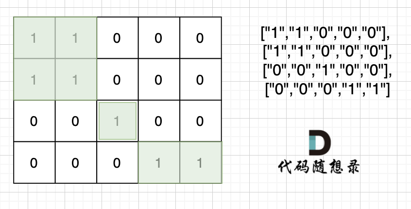

**力扣（695）：**

给你一个大小为 `m x n` 的二进制矩阵 `grid` 。

**岛屿** 是由一些相邻的 `1` (代表土地) 构成的组合，这里的「相邻」要求两个 `1` 必须在 **水平或者竖直的四个方向上** 相邻。你可以假设 `grid` 的四个边缘都被 `0`（代表水）包围着。

岛屿的面积是岛上值为 `1` 的单元格的数目。

计算并返回 `grid` 中最大的岛屿面积。如果没有岛屿，则返回面积为 `0` 。

**示例 1：**


```
输入：grid = [[0,0,1,0,0,0,0,1,0,0,0,0,0],[0,0,0,0,0,0,0,1,1,1,0,0,0],[0,1,1,0,1,0,0,0,0,0,0,0,0],[0,1,0,0,1,1,0,0,1,0,1,0,0],[0,1,0,0,1,1,0,0,1,1,1,0,0],[0,0,0,0,0,0,0,0,0,0,1,0,0],[0,0,0,0,0,0,0,1,1,1,0,0,0],[0,0,0,0,0,0,0,1,1,0,0,0,0]]
输出：6
解释：答案不应该是 11 ，因为岛屿只能包含水平或垂直这四个方向上的 1 。
```

**示例 2：**

```
输入：grid = [[0,0,0,0,0,0,0,0]]
输出：0
```

**提示：**

- `m == grid.length`
- `n == grid[i].length`
- `1 <= m, n <= 50`
- `grid[i][j]` 为 `0` 或 `1`


自己写的：

```cpp
class Solution {
public:
    int dir[4][2] = { {0,1},{1,0},{0,-1},{-1,0} };
    int cnt;

    void bfs(const vector<vector<int>>& grid, vector<vector<bool>>& isvisited, int m, int n) {
        queue<pair<int, int>> que;
        que.push({ m,n });
        isvisited[m][n] = 1;
        cnt++;
        while (!que.empty()) {
            pair<int, int> node = que.front();
            que.pop();
            int nodex = node.first;
            int nodey = node.second;
            for (int i = 0; i < 4; ++i) {
                int nextx = nodex + dir[i][0];
                int nexty = nodey + dir[i][1];

                if (nextx < 0 || nexty < 0 || nextx >= grid.size() || nexty >= grid[0].size())
                    continue;

                if (!isvisited[nextx][nexty] && grid[nextx][nexty] == 1) {
                    que.push({ nextx,nexty });
                    isvisited[nextx][nexty] = 1;
                    cnt++;
                }
            }
        }
    }

    int maxAreaOfIsland(vector<vector<int>>& grid) {
        int m = grid.size();
        int n = grid[0].size();

        vector<vector<bool>> isvisited(m, vector<bool>(n, 0));

        int result = 0;
        for (int i = 0; i < m; ++i) {
            for (int j = 0; j < n; ++j) {
                if (!isvisited[i][j] && grid[i][j] == 1) {
                    cnt = 0;
                    bfs(grid, isvisited, i, j);
                    result = max(result, cnt);
                }
            }
        }

        return result;
    }
};
```

思路掌握了，就是写的时候要细心点了


教学的：

注意题目中每座岛屿只能由**水平方向和/或竖直方向上**相邻的陆地连接形成。

也就是说斜角度链接是不算了， 例如示例二，是三个岛屿，如图：



这道题目也是 dfs bfs基础类题目，就是搜索每个岛屿上“1”的数量，然后取一个最大的。


### DFS

很多同学，写dfs其实也是凭感觉来，有的时候dfs函数中写终止条件才能过，有的时候 dfs函数不写终止添加也能过！

这里其实涉及到dfs的两种写法。

写法一，dfs只处理下一个节点，即在主函数遇到岛屿就计数为1，dfs处理接下来的相邻陆地

```cpp
// 版本一
class Solution {
private:
    int count;
    int dir[4][2] = {0, 1, 1, 0, -1, 0, 0, -1}; // 四个方向
    void dfs(vector<vector<int>>& grid, vector<vector<bool>>& visited, int x, int y) {
        for (int i = 0; i < 4; i++) {
            int nextx = x + dir[i][0];
            int nexty = y + dir[i][1];
            if (nextx < 0 || nextx >= grid.size() || nexty < 0 || nexty >= grid[0].size()) continue;  // 越界了，直接跳过
            if (!visited[nextx][nexty] && grid[nextx][nexty] == 1) { // 没有访问过的 同时 是陆地的

                visited[nextx][nexty] = true;
                count++;
                dfs(grid, visited, nextx, nexty);
            }
        }
    }

public:
    int maxAreaOfIsland(vector<vector<int>>& grid) {
        int n = grid.size(), m = grid[0].size();
        vector<vector<bool>> visited = vector<vector<bool>>(n, vector<bool>(m, false));

        int result = 0;
        for (int i = 0; i < n; i++) {
            for (int j = 0; j < m; j++) {
                if (!visited[i][j] && grid[i][j] == 1) {
                    count = 1;  // 因为dfs处理下一个节点，所以这里遇到陆地了就先计数，dfs处理接下来的相邻陆地
                    visited[i][j] = true;
                    dfs(grid, visited, i, j); // 将与其链接的陆地都标记上 true
                    result = max(result, count);
                }
            }
        }
        return result;
    }
};
```


写法二，dfs处理当前节点，即即在主函数遇到岛屿就计数为0，dfs处理接下来的全部陆地

```cpp
// 版本二
class Solution {
private:
    int count;
    int dir[4][2] = {0, 1, 1, 0, -1, 0, 0, -1}; // 四个方向
    void dfs(vector<vector<int>>& grid, vector<vector<bool>>& visited, int x, int y) {
        if (visited[x][y] || grid[x][y] == 0) return; // 终止条件：访问过的节点 或者 遇到海水
        visited[x][y] = true; // 标记访问过
        count++;
        for (int i = 0; i < 4; i++) {
            int nextx = x + dir[i][0];
            int nexty = y + dir[i][1];
            if (nextx < 0 || nextx >= grid.size() || nexty < 0 || nexty >= grid[0].size()) continue;  // 越界了，直接跳过
            dfs(grid, visited, nextx, nexty);
        }
    }

public:
    int maxAreaOfIsland(vector<vector<int>>& grid) {
        int n = grid.size(), m = grid[0].size();
        vector<vector<bool>> visited = vector<vector<bool>>(n, vector<bool>(m, false));
        int result = 0;
        for (int i = 0; i < n; i++) {
            for (int j = 0; j < m; j++) {
                if (!visited[i][j] && grid[i][j] == 1) {
                    count = 0; // 因为dfs处理当前节点，所以遇到陆地计数为0，进dfs之后在开始从1计数
                    dfs(grid, visited, i, j); // 将与其链接的陆地都标记上 true
                    result = max(result, count);
                }
            }
        }
        return result;
    }
};
```

大家通过注释可以发现，两种写法，版本一，在主函数遇到陆地就计数为1，接下来的相邻陆地都在dfs中计算。 版本二 在主函数遇到陆地 计数为0，也就是不计数，陆地数量都去dfs里做计算。

这也是为什么大家看了很多，dfs的写法，发现写法怎么都不一样呢？ 其实这就是根本原因。

以上两种写法的区别，我在题解： [DFS，BDF 你没注意的细节都给你列出来了！LeetCode：200. 岛屿数量 ](https://leetcode.cn/problems/number-of-islands/solution/by-carlsun-2-n72a/)做了详细介绍


### BFS

本题BFS代码如下：

```cpp
class Solution {
private:
    int count;
    int dir[4][2] = {0, 1, 1, 0, -1, 0, 0, -1}; // 四个方向
    void bfs(vector<vector<int>>& grid, vector<vector<bool>>& visited, int x, int y) {
        queue<int> que;
        que.push(x);
        que.push(y);
        visited[x][y] = true; // 加入队列就意味节点是陆地可到达的点
        count++;
        while(!que.empty()) {
            int xx = que.front();que.pop();
            int yy = que.front();que.pop();
            for (int i = 0 ;i < 4; i++) {
                int nextx = xx + dir[i][0];
                int nexty = yy + dir[i][1];
                if (nextx < 0 || nextx >= grid.size() || nexty < 0 || nexty >= grid[0].size()) continue; // 越界
                if (!visited[nextx][nexty] && grid[nextx][nexty] == 1) { // 节点没有被访问过且是陆地
                    visited[nextx][nexty] = true;
                    count++;
                    que.push(nextx);
                    que.push(nexty);
                }
            }
        }
    }

public:
    int maxAreaOfIsland(vector<vector<int>>& grid) {
        int n = grid.size(), m = grid[0].size();
        vector<vector<bool>> visited = vector<vector<bool>>(n, vector<bool>(m, false));
        int result = 0;
        for (int i = 0; i < n; i++) {
            for (int j = 0; j < m; j++) {
                if (!visited[i][j] && grid[i][j] == 1) {
                    count = 0;
                    bfs(grid, visited, i, j); // 将与其链接的陆地都标记上 true
                    result = max(result, count);
                }
            }
        }
        return result;
    }
};
```