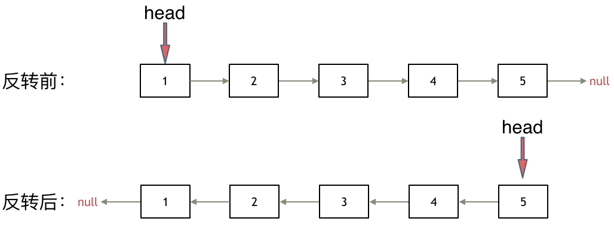

**力扣（206）：**

给你单链表的头节点 `head` ，请你反转链表，并返回反转后的链表。

**示例 1：**


```
输入：head = [1,2,3,4,5]
输出：[5,4,3,2,1]
```

**示例 2：**


```
输入：head = [1,2]
输出：[2,1]
```

**示例 3：**

```
输入：head = []
输出：[]
```

**提示：**

- 链表中节点的数目范围是 `[0, 5000]`
- `-5000 <= Node.val <= 5000`


挺扩展思路的一道题

先看看**双指针法**：

只需要改变链表的next指针的指向，直接将链表反转 ，而不用重新定义一个新的链表，如图所示:



之前链表的头节点是元素1， 反转之后头结点就是元素5 ，这里并没有添加或者删除节点，仅仅是改变next指针的方向。（纠正：动画应该是先移动pre，再移动cur）


首先定义一个cur指针，指向头结点，再定义一个pre指针，初始化为null。

然后就要开始反转了，首先要把 cur->next 节点用tmp指针保存一下，也就是保存一下这个节点。

接下来，就是循环走如下代码逻辑了，继续移动pre和cur指针。

最后，cur 指针已经指向了null，循环结束，链表也反转完毕了。 此时我们return pre指针就可以了，pre指针就指向了新的头结点。

```cpp
class Solution {
public:
    ListNode* reverseList(ListNode* head) {
        ListNode* temp; // 保存cur的下一个节点
        ListNode* cur = head;
        ListNode* pre = NULL;
        while(cur) {
            temp = cur->next;  // 保存一下 cur的下一个节点，因为接下来要改变cur->next
            cur->next = pre; // 翻转操作
            // 更新pre 和 cur指针
            pre = cur;
            cur = temp;
        }
        return pre;
    }
};
```

- 时间复杂度: O(n)
- 空间复杂度: O(1)


然后是很厉害的**递归法**：

和双指针法是一样的逻辑，同样是当cur为空的时候循环结束，不断将cur指向pre的过程。

关键是初始化的地方，可以看到双指针法中初始化 cur = head，pre = NULL，在递归法中可以从如下代码看出初始化的逻辑也是一样的，只不过写法变了。

```cpp
class Solution {
public:
    ListNode* reverse(ListNode* pre,ListNode* cur){
        if(cur == NULL) return pre;
        ListNode* temp = cur->next;
        cur->next = pre;
        // 可以和双指针法的代码进行对比，如下递归的写法，其实就是做了这两步
        // pre = cur;
        // cur = temp;
        return reverse(cur,temp);
    }
    ListNode* reverseList(ListNode* head) {
        // 和双指针法初始化是一样的逻辑
        // ListNode* cur = head;
        // ListNode* pre = NULL;
        return reverse(NULL, head);
    }

};
```

- 时间复杂度: O(n), 要递归处理链表的每个节点
- 空间复杂度: O(n), 递归调用了 n 层栈空间


上面的递归写法和双指针法实质上都是从前往后翻转指针指向，其实还有另外一种与双指针法不同思路的递归写法：从后往前翻转指针指向。

```cpp
class Solution {
public:
    ListNode* reverseList(ListNode* head) {
        // 边缘条件判断
        if(head == NULL) return NULL;
        if (head->next == NULL) return head;
        
        // 递归调用，翻转第二个节点开始往后的链表
        ListNode *last = reverseList(head->next);
        // 翻转头节点与第二个节点的指向
        head->next->next = head;
        // 此时的 head 节点为尾节点，next 需要指向 NULL
        head->next = NULL;
        return last;
    }
}; 
```

看这个的时候我觉得思路有点复杂，之后专门学习递归的内容了看看能不能理解的好一点


# 总结：

这道题主要也还是思路和方法，多看多写多记。

还有虽然我很不喜欢递归的方法，但是看来还是要好好学啊，争取能熟练掌握递归的思维