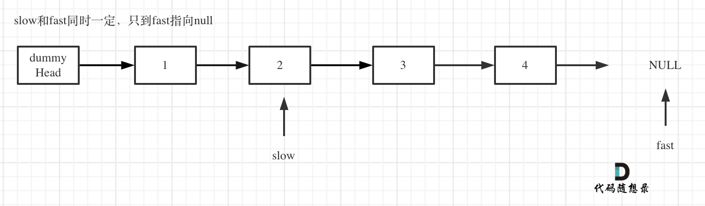

**力扣（19）：**

给你一个链表，删除链表的倒数第 `n` 个结点，并且返回链表的头结点。

**示例 1：**


```
输入：head = [1,2,3,4,5], n = 2
输出：[1,2,3,5]
```

**示例 2：**

```
输入：head = [1], n = 1
输出：[]
```

**示例 3：**

```
输入：head = [1,2], n = 1
输出：[1]
```

**提示：**

- 链表中结点的数目为 `sz`
- `1 <= sz <= 30`
- `0 <= Node.val <= 100`
- `1 <= n <= sz`


先来自己写的代码：

用了两遍遍历，麻烦了点：

```cpp
class Solution {
public:
	ListNode* removeNthFromEnd(ListNode* head, int n) {
		ListNode* dummyhead = new ListNode(0);
		dummyhead->next = head;
		ListNode* p;
		p = dummyhead;
		int cnt = 0;
		while (p->next != NULL)
		{
			p = p->next;
			cnt++;
		}

		ListNode* cur;
		cur = dummyhead;

		for (int i = 0; i < cnt - n; ++i)
			cur = cur->next;

		ListNode* tmp = cur->next;
		cur->next = tmp->next;
		delete tmp;
		tmp = nullptr;

		head = dummyhead->next;
		delete dummyhead;
		return head;
	}
};
```


再来看教学的：

双指针的经典应用，如果要删除倒数第n个节点，让fast移动n步，然后让fast和slow同时移动，直到fast指向链表末尾。删掉slow所指向的节点就可以了。

- 定义fast指针和slow指针，初始值为虚拟头结点，如图：


- fast首先走n + 1步 ，为什么是n+1呢，因为只有这样同时移动的时候slow才能指向删除节点的上一个节点（方便做删除操作），如图： 


- fast和slow同时移动，直到fast指向末尾，如题：



- 删除slow指向的下一个节点，如图：


```cpp
class Solution {
public:
    ListNode* removeNthFromEnd(ListNode* head, int n) {
        ListNode* dummyHead = new ListNode(0);
        dummyHead->next = head;
        ListNode* slow = dummyHead;
        ListNode* fast = dummyHead;
        while(n-- && fast != NULL) {
            fast = fast->next;
        }
        fast = fast->next; // fast再提前走一步，因为需要让slow指向删除节点的上一个节点
        while (fast != NULL) {
            fast = fast->next;
            slow = slow->next;
        }
        slow->next = slow->next->next; 
        
        // ListNode *tmp = slow->next;  C++释放内存的逻辑
        // slow->next = tmp->next;
        // delete nth;
        
        return dummyHead->next;
    }
};
```

- 时间复杂度: O(n)
- 空间复杂度: O(1)


其实我认为教学的这个方法有个局限性。题目限制了n<=结点数sz，但是设想一下如果没有这个限制，当n大于sz的时候，在第一个循环里，fast指针会先指向NULL，跳出循环后执行fast=fast->next报错。所以这种解法只适用于这道题，这让我感觉有点心里堵得慌。但是整体的思路还是要学习记忆的。