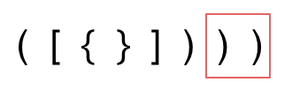

**力扣（20）：**

给定一个只包括 `'('`，`')'`，`'{'`，`'}'`，`'['`，`']'` 的字符串 `s` ，判断字符串是否有效。

有效字符串需满足：

1. 左括号必须用相同类型的右括号闭合。
2. 左括号必须以正确的顺序闭合。
3. 每个右括号都有一个对应的相同类型的左括号。

**示例 1：**

```
输入：s = "()"
输出：true
```

**示例 2：**

```
输入：s = "()[]{}"
输出：true
```

**示例 3：**

```
输入：s = "(]"
输出：false
```

**提示：**

- `1 <= s.length <= 104`
- `s` 仅由括号 `'()[]{}'` 组成


首先要弄清楚，字符串里的括号不匹配有几种情况。建议在写代码之前要分析好有哪几种不匹配的情况，如果不在动手之前分析好，写出的代码也会有很多问题。

先来分析一下 这里有三种不匹配的情况，

1. 第一种情况，字符串里左方向的括号多余了 ，所以不匹配。


2. 第二种情况，括号没有多余，但是 括号的类型没有匹配上。 


3. 第三种情况，字符串里右方向的括号多余了，所以不匹配。



第一种情况：已经遍历完了字符串，但是栈不为空，说明有相应的左括号没有右括号来匹配，所以return false

第二种情况：遍历字符串匹配的过程中，发现栈里没有要匹配的字符。所以return false

第三种情况：遍历字符串匹配的过程中，栈已经为空了，没有匹配的字符了，说明右括号没有找到对应的左括号return false

那么什么时候说明左括号和右括号全都匹配了呢，就是字符串遍历完之后，栈是空的，就说明全都匹配了。


还有一些技巧，在匹配左括号的时候，右括号先入栈，就只需要比较当前元素和栈顶相不相等就可以了，比左括号先入栈代码实现要简单的多了

```c++
class Solution {
public:
    bool isValid(string s) {
        if (s.size() % 2 != 0) return false; // 如果s的长度为奇数，一定不符合要求
        stack<char> st;
        for (int i = 0; i < s.size(); i++) {
            if (s[i] == '(') st.push(')');
            else if (s[i] == '{') st.push('}');
            else if (s[i] == '[') st.push(']');
            // 第三种情况：遍历字符串匹配的过程中，栈已经为空了，没有匹配的字符了，说明右括号没有找到对应的左括号 return false
            // 第二种情况：遍历字符串匹配的过程中，发现栈里没有我们要匹配的字符。所以return false
            else if (st.empty() || st.top() != s[i]) return false;
            else st.pop(); // st.top() 与 s[i]相等，栈弹出元素
        }
        // 第一种情况：此时我们已经遍历完了字符串，但是栈不为空，说明有相应的左括号没有右括号来匹配，所以return false，否则就return true
        return st.empty();
    }
};
```

- 时间复杂度: O(n)
- 空间复杂度: O(n)


# 总结

对称、匹配类型的题目可以优先考虑用栈来解决，同时要注意入栈出栈时的元素匹配，栈内元素为空、站内元素不为空分别是什么情况等