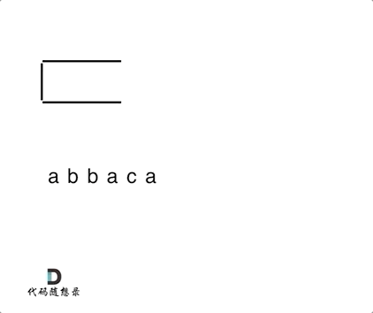

**力扣（1047）：**

给出由小写字母组成的字符串 `S`，**重复项删除操作**会选择两个相邻且相同的字母，并删除它们。

在 S 上反复执行重复项删除操作，直到无法继续删除。

在完成所有重复项删除操作后返回最终的字符串。答案保证唯一。

**示例：**

```
输入："abbaca"
输出："ca"
解释：
例如，在 "abbaca" 中，我们可以删除 "bb" 由于两字母相邻且相同，这是此时唯一可以执行删除操作的重复项。之后我们得到字符串 "aaca"，其中又只有 "aa" 可以执行重复项删除操作，所以最后的字符串为 "ca"。
```

**提示：**

1. `1 <= S.length <= 20000`
2. `S` 仅由小写英文字母组成。


自己写的：

```cpp
class Solution {
public:
    string removeDuplicates(string s) {

        stack<char> st;
        for (int i = 0; i < s.size(); ++i)
        {
            if (st.empty() || s[i] != st.top())
                st.push(s[i]);
            else
                st.pop();
        }
        string result;
        while (!st.empty())
        {
            result = result + st.top();
            st.pop();
        }

        reverse(result.begin(), result.end());
        return result;
    }
};
```

但是力扣上提示爆内存了


教学的：

我们在删除相邻重复项的时候，其实就是要知道当前遍历的这个元素，我们在前一位是不是遍历过一样数值的元素，那么如何记录前面遍历过的元素呢？

所以就是用栈来存放，那么栈的目的，就是存放遍历过的元素，当遍历当前的这个元素的时候，去栈里看一下我们是不是遍历过相同数值的相邻元素。

然后再去做对应的消除操作。 如动画所示：



从栈中弹出剩余元素，此时是字符串ac，因为从栈里弹出的元素是倒序的，所以再对字符串进行反转一下，就得到了最终的结果。

```cpp
class Solution {
public:
    string removeDuplicates(string S) {
        stack<char> st;
        for (char s : S) {
            if (st.empty() || s != st.top()) {
                st.push(s);
            } else {
                st.pop(); // s 与 st.top()相等的情况
            }
        }
        string result = "";
        while (!st.empty()) { // 将栈中元素放到result字符串汇总
            result += st.top();
            st.pop();
        }
        reverse (result.begin(), result.end()); // 此时字符串需要反转一下
        return result;

    }
};
```

- 时间复杂度: O(n)
- 空间复杂度: O(n)


当然可以拿字符串直接作为栈，这样省去了栈还要转为字符串的操作。

```cpp
class Solution {
public:
    string removeDuplicates(string S) {
        string result;
        for(char s : S) {
            if(result.empty() || result.back() != s) {
                result.push_back(s);
            }
            else {
                result.pop_back();
            }
        }
        return result;
    }
};
```

- 时间复杂度: O(n)
- 空间复杂度: O(1)，返回值不计空间复杂度


# 总结

这题就是要注意内存问题了，选用需要反转字符的方法的话会很占用内存，这样就要注意到字符串也可以使用栈的思想进行操作。