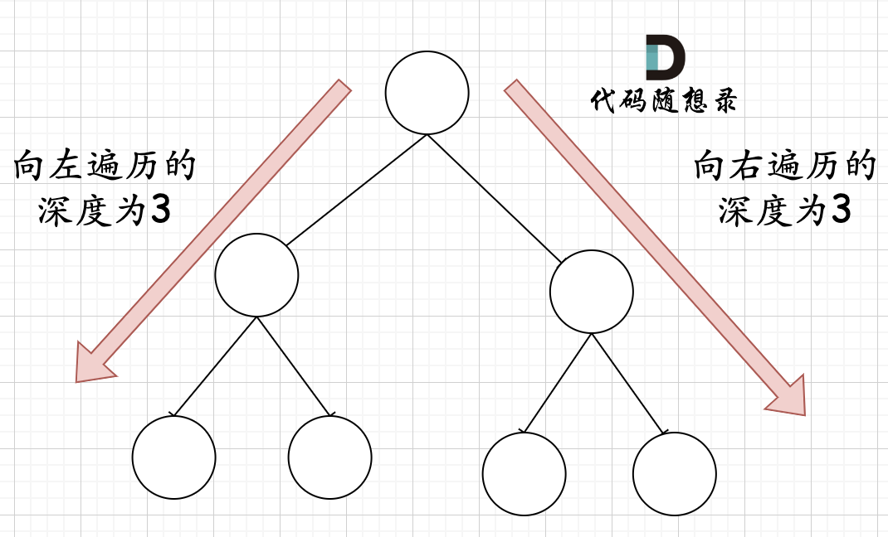

**力扣（222）：**

给你一棵 **完全二叉树** 的根节点 `root` ，求出该树的节点个数。

完全二叉树的定义如下：在完全二叉树中，除了最底层节点可能没填满外，其余每层节点数都达到最大值，并且最下面一层的节点都集中在该层最左边的若干位置。若最底层为第 `h` 层，则该层包含 `1~ 2h` 个节点。

**示例 1：**


```
输入：root = [1,2,3,4,5,6]
输出：6
```

**示例 2：**

```
输入：root = []
输出：0
```

**示例 3：**

```
输入：root = [1]
输出：1
```

**提示：**

- 树中节点的数目范围是`[0, 5 * 104]`
- `0 <= Node.val <= 5 * 104`
- 题目数据保证输入的树是 **完全二叉树**


自己写的：

```cpp
class Solution {
public:
    int countNodes(TreeNode* root) {
        queue<TreeNode*> que;
        if (root != NULL)
            que.push(root);
        int result = 0;
        while (!que.empty()) {
            int size = que.size();
            for (int i = 0; i < size; ++i) {
                TreeNode* node = que.front();
                que.pop();
                if (node->left)
                    que.push(node->left);
                if (node->right)
                    que.push(node->right);
                result++;
            }
        }

        return result;
    }
};
```


教学上的：

本篇给出按照普通二叉树的求法以及利用完全二叉树性质的求法。

### 普通二叉树

首先按照普通二叉树的逻辑来求。

这道题目的递归法和求二叉树的深度写法类似， 而迭代法，[二叉树：层序遍历登场！](https://programmercarl.com/0102.二叉树的层序遍历.html)遍历模板稍稍修改一下，记录遍历的节点数量就可以了。


#### 递归

递归遍历的顺序依然是后序（左右中）。

1.确定递归函数的参数和返回值：参数就是传入树的根节点，返回就返回以该节点为根节点二叉树的节点数量，所以返回值为int类型。

代码如下：

```cpp
int getNodesNum(TreeNode* cur) {
```

2.确定终止条件：如果为空节点的话，就返回0，表示节点数为0。

代码如下：

```cpp
if (cur == NULL) return 0;
```

3.确定单层递归的逻辑：先求它的左子树的节点数量，再求右子树的节点数量，最后取总和再加一 （加1是因为算上当前中间节点）就是目前节点为根节点的节点数量。

代码如下：

```cpp
int leftNum = getNodesNum(cur->left);      // 左
int rightNum = getNodesNum(cur->right);    // 右
int treeNum = leftNum + rightNum + 1;      // 中
return treeNum;
```

整体C++代码如下：

```cpp
// 版本一
class Solution {
private:
    int getNodesNum(TreeNode* cur) {
        if (cur == NULL) return 0;
        int leftNum = getNodesNum(cur->left);      // 左
        int rightNum = getNodesNum(cur->right);    // 右
        int treeNum = leftNum + rightNum + 1;      // 中
        return treeNum;
    }
public:
    int countNodes(TreeNode* root) {
        return getNodesNum(root);
    }
};
```

代码精简之后C++代码如下：

```cpp
// 版本二
class Solution {
public:
    int countNodes(TreeNode* root) {
        if (root == NULL) return 0;
        return 1 + countNodes(root->left) + countNodes(root->right);
    }
};
```

- 时间复杂度：O(n)
- 空间复杂度：O(log n)，算上了递归系统栈占用的空间


#### 迭代

只要模板少做改动，加一个变量result，统计节点数量就可以了

```cpp
class Solution {
public:
    int countNodes(TreeNode* root) {
        queue<TreeNode*> que;
        if (root != NULL) que.push(root);
        int result = 0;
        while (!que.empty()) {
            int size = que.size();
            for (int i = 0; i < size; i++) {
                TreeNode* node = que.front();
                que.pop();
                result++;   // 记录节点数量
                if (node->left) que.push(node->left);
                if (node->right) que.push(node->right);
            }
        }
        return result;
    }
};
```

- 时间复杂度：O(n)
- 空间复杂度：O(n)


### 完全二叉树

以上方法都是按照普通二叉树来做的

在完全二叉树中，除了最底层节点可能没填满外，其余每层节点数都达到最大值，并且最下面一层的节点都集中在该层最左边的若干位置。若最底层为第 h 层，则该层包含 1~ 2^(h-1)  个节点。


完全二叉树只有两种情况，情况一：就是满二叉树，情况二：最后一层叶子节点没有满。

对于情况一，可以直接用 2^树深度 - 1 来计算，注意这里根节点深度为1。

对于情况二，分别递归左孩子，和右孩子，递归到某一深度一定会有左孩子或者右孩子为满二叉树，然后依然可以按照情况1来计算。

完全二叉树（一）如图：


完全二叉树（二）如图：


可以看出如果整个树不是满二叉树，就递归其左右孩子，直到遇到满二叉树为止，用公式计算这个子树（满二叉树）的节点数量。

这里关键在于如何去判断一个左子树或者右子树是不是满二叉树呢？

在完全二叉树中，如果递归向左遍历的深度等于递归向右遍历的深度，那说明就是满二叉树。如图：



在完全二叉树中，如果递归向左遍历的深度不等于递归向右遍历的深度，则说明不是满二叉树，如图：


判断其子树是不是满二叉树，如果是则利用公式计算这个子树（满二叉树）的节点数量，如果不是则继续递归，那么 在递归三部曲中，第二部：终止条件的写法应该是这样的：

```cpp
if (root == nullptr) return 0; 
// 开始根据左深度和右深度是否相同来判断该子树是不是满二叉树
TreeNode* left = root->left;
TreeNode* right = root->right;
int leftDepth = 0, rightDepth = 0; // 这里初始为0是有目的的，为了下面求指数方便
while (left) {  // 求左子树深度
    left = left->left;
    leftDepth++;
}
while (right) { // 求右子树深度
    right = right->right;
    rightDepth++;
}
if (leftDepth == rightDepth) {
    return (2 << leftDepth) - 1; // 注意(2<<1) 相当于2^2，返回满足满二叉树的子树节点数量
}
```

递归三部曲，第三部，单层递归的逻辑：（可以看出使用后序遍历）

```cpp
int leftTreeNum = countNodes(root->left);       // 左
int rightTreeNum = countNodes(root->right);     // 右
int result = leftTreeNum + rightTreeNum + 1;    // 中
return result;
```

该部分精简之后代码为：

```cpp
return countNodes(root->left) + countNodes(root->right) + 1; 
```

最后整体C++代码如下：

```cpp
class Solution {
public:
    int countNodes(TreeNode* root) {
        if (root == nullptr) return 0;
        TreeNode* left = root->left;
        TreeNode* right = root->right;
        int leftDepth = 0, rightDepth = 0; // 这里初始为0是有目的的，为了下面求指数方便
        while (left) {  // 求左子树深度
            left = left->left;
            leftDepth++;
        }
        while (right) { // 求右子树深度
            right = right->right;
            rightDepth++;
        }
        if (leftDepth == rightDepth) {
            return (2 << leftDepth) - 1; // 注意(2<<1) 相当于2^2，所以leftDepth初始为0
        }
        return countNodes(root->left) + countNodes(root->right) + 1;
    }
};
```

- 时间复杂度：O(log n × log n)
- 空间复杂度：O(log n)