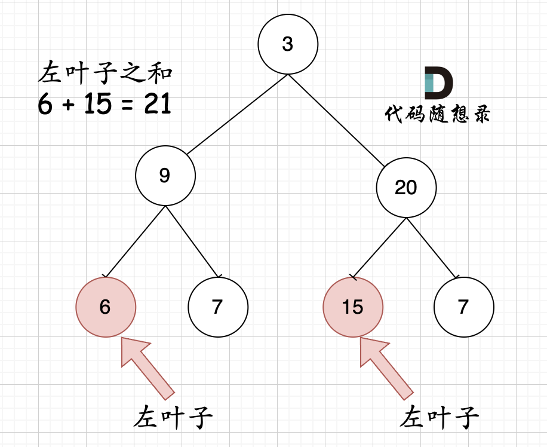

**力扣（404）：**

给定二叉树的根节点 `root` ，返回所有左叶子之和。

**示例 1：**


```
输入: root = [3,9,20,null,null,15,7] 
输出: 24 
解释: 在这个二叉树中，有两个左叶子，分别是 9 和 15，所以返回 24
```

**示例 2:**

```
输入: root = [1]
输出: 0
```

**提示:**

- 节点数在 `[1, 1000]` 范围内
- `-1000 <= Node.val <= 1000`


自己写的：

递归还是要学的，所以尝试了不喜欢的递归：（其实还挺好玩的）

```cpp
class Solution {
public:

    void findLeft(TreeNode* node,int& result,bool flag) {
        if (node->left == NULL && node->right == NULL && flag == 1) {
            result += node->val;
            return;
        }

        if (node->left)
            findLeft(node->left, result, 1);
        if (node->right)
            findLeft(node->right, result, 0);
    }

    int sumOfLeftLeaves(TreeNode* root) {
        if (root == NULL)
            return 0;
        int result = 0;
        findLeft(root, result, 0);
        return result;
    }
};
```

迭代方法一下子没想出来


教学上的：

**首先要注意是判断左叶子，不是二叉树左侧节点，所以不要上来想着层序遍历。**

因为题目中其实没有说清楚左叶子究竟是什么节点，那么这里给出左叶子的明确定义：**节点A的左孩子不为空，且左孩子的左右孩子都为空（说明是叶子节点），那么A节点的左孩子为左叶子节点**

思考一下如下图中二叉树，左叶子之和究竟是多少？


**其实是0，因为这棵树根本没有左叶子！*

但看这个图的左叶子之和是多少？



那么**判断当前节点是不是左叶子是无法判断的，必须要通过节点的父节点来判断其左孩子是不是左叶子。**

如果该节点的左节点不为空，该节点的左节点的左节点为空，该节点的左节点的右节点为空，则找到了一个左叶子，判断代码如下：

```cpp
if (node->left != NULL && node->left->left == NULL && node->left->right == NULL) {
    左叶子节点处理逻辑
}
```

### 递归法

递归的遍历顺序为后序遍历（左右中），是因为要通过递归函数的返回值来累加求取左叶子数值之和。

递归三部曲：

1.确定递归函数的参数和返回值

判断一个树的左叶子节点之和，那么一定要传入树的根节点，递归函数的返回值为数值之和，所以为int

使用题目中给出的函数就可以了。

2.确定终止条件

如果遍历到空节点，那么左叶子值一定是0

```cpp
if (root == NULL) return 0;
```

注意，只有当前遍历的节点是父节点，才能判断其子节点是不是左叶子。 所以如果当前遍历的节点是叶子节点，那其左叶子也必定是0，那么终止条件为：

```cpp
if (root == NULL) return 0;
if (root->left == NULL && root->right== NULL) return 0; //其实这个也可以不写，如果不写不影响结果，但就会让递归多进行了一层。
```

3.确定单层递归的逻辑

当遇到左叶子节点的时候，记录数值，然后通过递归求取左子树左叶子之和，和 右子树左叶子之和，相加便是整个树的左叶子之和。

代码如下：

```cpp
int leftValue = sumOfLeftLeaves(root->left);    // 左
if (root->left && !root->left->left && !root->left->right) {
    leftValue = root->left->val;
}
int rightValue = sumOfLeftLeaves(root->right);  // 右

int sum = leftValue + rightValue;               // 中
return sum;
```

整体递归代码如下：

```cpp
class Solution {
public:
    int sumOfLeftLeaves(TreeNode* root) {
        if (root == NULL) return 0;
        if (root->left == NULL && root->right== NULL) return 0;

        int leftValue = sumOfLeftLeaves(root->left);    // 左
        if (root->left && !root->left->left && !root->left->right) { // 左子树就是一个左叶子的情况
            leftValue = root->left->val;
        }
        int rightValue = sumOfLeftLeaves(root->right);  // 右

        int sum = leftValue + rightValue;               // 中
        return sum;
    }
};
```

以上代码精简之后如下：

```cpp
class Solution {
public:
    int sumOfLeftLeaves(TreeNode* root) {
        if (root == NULL) return 0;
        int leftValue = 0;
        if (root->left != NULL && root->left->left == NULL && root->left->right == NULL) {
            leftValue = root->left->val;
        }
        return leftValue + sumOfLeftLeaves(root->left) + sumOfLeftLeaves(root->right);
    }
};
```


### 迭代法

本题迭代法使用前中后序都是可以的，只要把左叶子节点统计出来，就可以了。

这里使用统一写法写一个前序遍历：

```cpp
class Solution {
public:
    int sumOfLeftLeaves(TreeNode* root) {
        stack<TreeNode*> st;
        if (root == NULL) return 0;
        st.push(root);
        int result = 0;
        while (!st.empty()) {
            TreeNode* node = st.top();
            st.pop();
            if (node->left != NULL && node->left->left == NULL && node->left->right == NULL) {
                result += node->left->val;
            }
            if (node->right) st.push(node->right);
            if (node->left) st.push(node->left);
        }
        return result;
    }
};
```


# 总结

一是明确题目的意思，到底什么是左叶子

二就是解题思路了，继续多写多练