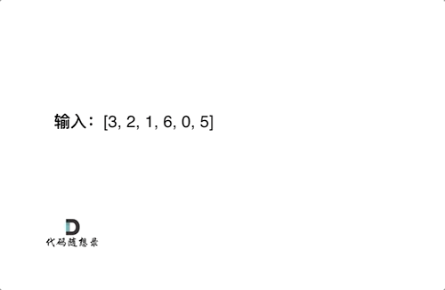

**力扣（654）：**

给定一个不重复的整数数组 `nums` 。 **最大二叉树** 可以用下面的算法从 `nums` 递归地构建:

1. 创建一个根节点，其值为 `nums` 中的最大值。
2. 递归地在最大值 **左边** 的 **子数组前缀上** 构建左子树。
3. 递归地在最大值 **右边** 的 **子数组后缀上** 构建右子树。

返回 *`nums` 构建的* ***最大二叉树\*** 。

**示例 1：**


```
输入：nums = [3,2,1,6,0,5]
输出：[6,3,5,null,2,0,null,null,1]
解释：递归调用如下所示：
- [3,2,1,6,0,5] 中的最大值是 6 ，左边部分是 [3,2,1] ，右边部分是 [0,5] 。
    - [3,2,1] 中的最大值是 3 ，左边部分是 [] ，右边部分是 [2,1] 。
        - 空数组，无子节点。
        - [2,1] 中的最大值是 2 ，左边部分是 [] ，右边部分是 [1] 。
            - 空数组，无子节点。
            - 只有一个元素，所以子节点是一个值为 1 的节点。
    - [0,5] 中的最大值是 5 ，左边部分是 [0] ，右边部分是 [] 。
        - 只有一个元素，所以子节点是一个值为 0 的节点。
        - 空数组，无子节点。
```

**示例 2：**


```
输入：nums = [3,2,1]
输出：[3,null,2,null,1]
```

**提示：**

- `1 <= nums.length <= 1000`
- `0 <= nums[i] <= 1000`
- `nums` 中的所有整数 **互不相同**


最大二叉树的构建过程如下：



构造树一般采用的是前序遍历，因为先构造中间节点，然后递归构造左子树和右子树。

- 确定递归函数的参数和返回值

参数传入的是存放元素的数组，返回该数组构造的二叉树的头结点，返回类型是指向节点的指针。

代码如下：

```cpp
TreeNode* constructMaximumBinaryTree(vector<int>& nums)
```

- 确定终止条件

题目中说了输入的数组大小一定是大于等于1的，所以我们不用考虑小于1的情况，那么当递归遍历的时候，如果传入的数组大小为1，说明遍历到了叶子节点了。

那么应该定义一个新的节点，并把这个数组的数值赋给新的节点，然后返回这个节点。 这表示一个数组大小是1的时候，构造了一个新的节点，并返回。

代码如下：

```cpp
TreeNode* node = new TreeNode(0);
if (nums.size() == 1) {
    node->val = nums[0];
    return node;
}
```

- 确定单层递归的逻辑

这里有三步工作

1.先要找到数组中最大的值和对应的下标， 最大的值构造根节点，下标用来下一步分割数组。

代码如下：

```cpp
int maxValue = 0;
int maxValueIndex = 0;
for (int i = 0; i < nums.size(); i++) {
    if (nums[i] > maxValue) {
        maxValue = nums[i];
        maxValueIndex = i;
    }
}
TreeNode* node = new TreeNode(0);
node->val = maxValue;
```

2.最大值所在的下标左区间 构造左子树

这里要判断maxValueIndex > 0，因为要保证左区间至少有一个数值。

代码如下：

```cpp
if (maxValueIndex > 0) {
    vector<int> newVec(nums.begin(), nums.begin() + maxValueIndex);
    node->left = constructMaximumBinaryTree(newVec);
}
```

3.最大值所在的下标右区间 构造右子树

判断maxValueIndex < (nums.size() - 1)，确保右区间至少有一个数值。

代码如下：

```cpp
if (maxValueIndex < (nums.size() - 1)) {
    vector<int> newVec(nums.begin() + maxValueIndex + 1, nums.end());
    node->right = constructMaximumBinaryTree(newVec);
}
```

这样我们就分析完了，整体代码如下：（详细注释）

```cpp
class Solution {
public:
    TreeNode* constructMaximumBinaryTree(vector<int>& nums) {
        TreeNode* node = new TreeNode(0);
        if (nums.size() == 1) {
            node->val = nums[0];
            return node;
        }
        // 找到数组中最大的值和对应的下标
        int maxValue = 0;
        int maxValueIndex = 0;
        for (int i = 0; i < nums.size(); i++) {
            if (nums[i] > maxValue) {
                maxValue = nums[i];
                maxValueIndex = i;
            }
        }
        node->val = maxValue;
        // 最大值所在的下标左区间 构造左子树
        if (maxValueIndex > 0) {
            vector<int> newVec(nums.begin(), nums.begin() + maxValueIndex);
            node->left = constructMaximumBinaryTree(newVec);
        }
        // 最大值所在的下标右区间 构造右子树
        if (maxValueIndex < (nums.size() - 1)) {
            vector<int> newVec(nums.begin() + maxValueIndex + 1, nums.end());
            node->right = constructMaximumBinaryTree(newVec);
        }
        return node;
    }
};
```

以上代码比较冗余，效率也不高，每次还要切割的时候每次都要定义新的vector（也就是数组），但逻辑比较清晰。

和之前一样的优化思路，就是每次分隔不用定义新的数组，而是通过下标索引直接在原数组上操作。

优化后代码如下：

```cpp
class Solution {
private:
    // 在左闭右开区间[left, right)，构造二叉树
    TreeNode* traversal(vector<int>& nums, int left, int right) {
        if (left >= right) return nullptr;

        // 分割点下标：maxValueIndex
        int maxValueIndex = left;
        for (int i = left + 1; i < right; ++i) {
            if (nums[i] > nums[maxValueIndex]) maxValueIndex = i;
        }

        TreeNode* root = new TreeNode(nums[maxValueIndex]);

        // 左闭右开：[left, maxValueIndex)
        root->left = traversal(nums, left, maxValueIndex);

        // 左闭右开：[maxValueIndex + 1, right)
        root->right = traversal(nums, maxValueIndex + 1, right);

        return root;
    }
public:
    TreeNode* constructMaximumBinaryTree(vector<int>& nums) {
        return traversal(nums, 0, nums.size());
    }
};
```


## 拓展

可以发现上面的代码看上去简洁一些，**主要是因为第二版其实是允许空节点进入递归，所以不用在递归的时候加判断节点是否为空**

第一版递归过程：（加了if判断，为了不让空节点进入递归）

```cpp
if (maxValueIndex > 0) { // 这里加了判断是为了不让空节点进入递归
    vector<int> newVec(nums.begin(), nums.begin() + maxValueIndex);
    node->left = constructMaximumBinaryTree(newVec);
}

if (maxValueIndex < (nums.size() - 1)) { // 这里加了判断是为了不让空节点进入递归
    vector<int> newVec(nums.begin() + maxValueIndex + 1, nums.end());
    node->right = constructMaximumBinaryTree(newVec);
}
```

第二版递归过程： （如下代码就没有加if判断）

```text
root->left = traversal(nums, left, maxValueIndex);

root->right = traversal(nums, maxValueIndex + 1, right);
```

第二版代码是允许空节点进入递归，所以没有加if判断，当然终止条件也要有相应的改变。

第一版终止条件，是遇到叶子节点就终止，因为空节点不会进入递归。

第二版相应的终止条件，是遇到空节点，也就是数组区间为0，就终止了


## 总结

这道题目其实和上一道构造二叉树是一个思路，还简单一些。

**注意类似用数组构造二叉树的题目，每次分隔尽量不要定义新的数组，而是通过下标索引直接在原数组上操作，这样可以节约时间和空间上的开销。**

什么时候递归函数前面加if，什么时候不加if，这个问题最后也给出了解释。

其实就是不同代码风格的实现，**一般情况来说：如果让空节点（空指针）进入递归，就不加if，如果不让空节点进入递归，就加if限制一下， 终止条件也会相应的调整。**