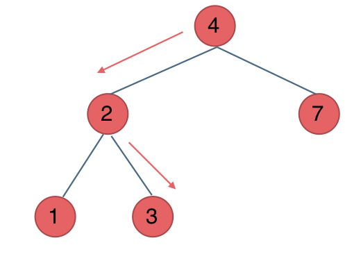

**力扣（700）：**

给定二叉搜索树（BST）的根节点 `root` 和一个整数值 `val`。

你需要在 BST 中找到节点值等于 `val` 的节点。 返回以该节点为根的子树。 如果节点不存在，则返回 `null` 。

**示例 1:**


```
输入：root = [4,2,7,1,3], val = 2
输出：[2,1,3]
```

**示例 2:**


```
输入：root = [4,2,7,1,3], val = 5
输出：[]
```

**提示：**

- 树中节点数在 `[1, 5000]` 范围内
- `1 <= Node.val <= 10^7`
- `root` 是二叉搜索树
- `1 <= val <= 10^7`


自己写的：

递归：

```cpp
class Solution {
public:
    TreeNode* searchBST(TreeNode* root, int val) {
        if (root == NULL)
            return NULL;

        if (root->val > val)
            return searchBST(root->left, val);
        else if (root->val < val)
            return searchBST(root->right, val);
        else
            return root;
    }
};
```


迭代：

```cpp
class Solution {
public:
    TreeNode* searchBST(TreeNode* root, int val) {
        queue<TreeNode*> que;
        if (root == NULL)
            return NULL;
        que.push(root);
        while (!que.empty()) {
            TreeNode* node = que.front();
            que.pop();
            if (node == NULL)
                return NULL;
            else if (node->val > val)
                que.push(node->left);
            else if (node->val < val)
                que.push(node->right);
            else
                return node;
        }
        return NULL;
    }
};
```

看了下面的解法，这个复杂了


教学的：

二叉搜索树是一个有序树：

- 若它的左子树不空，则左子树上所有结点的值均小于它的根结点的值；
- 若它的右子树不空，则右子树上所有结点的值均大于它的根结点的值；
- 它的左、右子树也分别为二叉搜索树

这就决定了，二叉搜索树，递归遍历和迭代遍历和普通二叉树都不一样。

本题，其实就是在二叉搜索树中搜索一个节点。

### 递归法

1.确定递归函数的参数和返回值

递归函数的参数传入的就是根节点和要搜索的数值，返回的就是以这个搜索数值所在的节点。

代码如下：

```cpp
TreeNode* searchBST(TreeNode* root, int val)
```

2.确定终止条件

如果root为空，或者找到这个数值了，就返回root节点。

```cpp
if (root == NULL || root->val == val) return root;
```

3.确定单层递归的逻辑

看看二叉搜索树的单层递归逻辑有何不同。

因为二叉搜索树的节点是有序的，所以可以有方向的去搜索。

如果root->val > val，搜索左子树，如果root->val < val，就搜索右子树，最后如果都没有搜索到，就返回NULL。

代码如下：

```cpp
TreeNode* result = NULL;
if (root->val > val) result = searchBST(root->left, val);
if (root->val < val) result = searchBST(root->right, val);
return result;
```

整体代码如下：

```cpp
class Solution {
public:
    TreeNode* searchBST(TreeNode* root, int val) {
        if (root == NULL || root->val == val) return root;
        TreeNode* result = NULL;
        if (root->val > val) result = searchBST(root->left, val);
        if (root->val < val) result = searchBST(root->right, val);
        return result;
    }
};
```

或者也可以这么写

```cpp
class Solution {
public:
    TreeNode* searchBST(TreeNode* root, int val) {
        if (root == NULL || root->val == val) return root;
        if (root->val > val) return searchBST(root->left, val);
        if (root->val < val) return searchBST(root->right, val);
        return NULL;
    }
};
```


### 迭代法

一提到二叉树遍历的迭代法，可能立刻想起使用栈来模拟深度遍历，使用队列来模拟广度遍历。

对于二叉搜索树可就不一样了，因为二叉搜索树的特殊性，也就是节点的有序性，可以不使用辅助栈或者队列就可以写出迭代法。

对于一般二叉树，递归过程中还有回溯的过程，例如走一个左方向的分支走到头了，那么要调头，在走右分支。

而**对于二叉搜索树，不需要回溯的过程，因为节点的有序性就帮我们确定了搜索的方向。**

例如要搜索元素为3的节点，**不需要搜索其他节点，也不需要做回溯，查找的路径已经规划好了。**

中间节点如果大于3就向左走，如果小于3就向右走，如图：



所以迭代法代码如下：

```cpp
class Solution {
public:
    TreeNode* searchBST(TreeNode* root, int val) {
        while (root != NULL) {
            if (root->val > val) root = root->left;
            else if (root->val < val) root = root->right;
            else return root;
        }
        return NULL;
    }
};
```


## 总结

本篇介绍了二叉搜索树的遍历方式，因为二叉搜索树的有序性，遍历的时候要比普通二叉树简单很多。

但是很容易忽略二叉搜索树的特性，所以写出遍历的代码就未必真的简单了。

所以针对二叉搜索树的题目，一样要利用其特性。