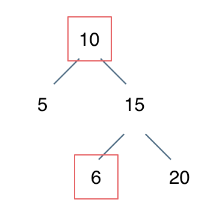

**力扣（98）：**

给你一个二叉树的根节点 `root` ，判断其是否是一个有效的二叉搜索树。

**有效** 二叉搜索树定义如下：

- 节点的左子树只包含小于当前节点的数。
- 节点的右子树只包含 **大于** 当前节点的数。
- 所有左子树和右子树自身必须也是二叉搜索树。

**示例 1：**


```
输入：root = [2,1,3]
输出：true
```

**示例 2：**


```
输入：root = [5,1,4,null,null,3,6]
输出：false
解释：根节点的值是 5 ，但是右子节点的值是 4 。
```

**提示：**

- 树中节点数目范围在`[1, 104]` 内
- `-2^31 <= Node.val <= 2^31 - 1`


自己写的：

```cpp
class Solution {
public:
    bool isValidBST(TreeNode* root) {
        if (root == NULL)
            return true;

        bool left_B = true;
        if (root->left) {
            if (root->val > root->left->val)
                left_B = isValidBST(root->left);
            else
                return false;
        }

        bool right_B = true;
        if (root->right) {
            if (root->val < root->right->val)
                right_B = isValidBST(root->right);
            else
                return false;
        }


        return (left_B && right_B);
    }
};
```

这是错的，原因在没有考虑右子树中会存在比根节点大的节点


教学的：

要知道中序遍历下，输出的二叉搜索树节点的数值是有序序列。

有了这个特性，**验证二叉搜索树，就相当于变成了判断一个序列是不是递增的了。**


### 递归法

可以递归中序遍历将二叉搜索树转变成一个数组，代码如下：

```cpp
vector<int> vec;
void traversal(TreeNode* root) {
    if (root == NULL) return;
    traversal(root->left);
    vec.push_back(root->val); // 将二叉搜索树转换为有序数组
    traversal(root->right);
}
```

然后只要比较一下，这个数组是否是有序的，**注意二叉搜索树中不能有重复元素**。

```cpp
traversal(root);
for (int i = 1; i < vec.size(); i++) {
    // 注意要小于等于，搜索树里不能有相同元素
    if (vec[i] <= vec[i - 1]) return false;
}
return true;
```

整体代码如下：

```cpp
class Solution {
private:
    vector<int> vec;
    void traversal(TreeNode* root) {
        if (root == NULL) return;
        traversal(root->left);
        vec.push_back(root->val); // 将二叉搜索树转换为有序数组
        traversal(root->right);
    }
public:
    bool isValidBST(TreeNode* root) {
        vec.clear(); // 不加这句在leetcode上也可以过，但最好加上
        traversal(root);
        for (int i = 1; i < vec.size(); i++) {
            // 注意要小于等于，搜索树里不能有相同元素
            if (vec[i] <= vec[i - 1]) return false;
        }
        return true;
    }
};
```

以上代码中，把二叉树转变为数组来判断，是最直观的，但其实不用转变成数组，可以在递归遍历的过程中直接判断是否有序。

这道题目比较容易陷入两个陷阱：

- 陷阱1

**不能单纯的比较左节点小于中间节点，右节点大于中间节点就完事了**。

写出了类似这样的代码：

```cpp
if (root->val > root->left->val && root->val < root->right->val) {
    return true;
} else {
    return false;
}
```

**要比较的是 左子树所有节点小于中间节点，右子树所有节点大于中间节点**。所以以上代码的判断逻辑是错误的。

例如： [10,5,15,null,null,6,20] 这个case：



节点10大于左节点5，小于右节点15，但右子树里出现了一个6 这就不符合了！

- 陷阱2

样例中最小节点 可能是int的最小值，如果这样使用最小的int来比较也是不行的。

此时可以初始化比较元素为longlong的最小值。

问题可以进一步演进：如果样例中根节点的val 可能是longlong的最小值 又要怎么办呢？

了解这些陷阱之后来看一下代码应该怎么写：

递归三部曲：

- 确定递归函数，返回值以及参数

要定义一个longlong的全局变量，用来比较遍历的节点是否有序，因为后台测试数据中有int最小值，所以定义为longlong的类型，初始化为longlong最小值。

在寻找一个不符合条件的节点，如果没有找到这个节点就遍历了整个树，如果找到不符合的节点了，立刻返回。

代码如下：

```cpp
long long maxVal = LONG_MIN; // 因为后台测试数据中有int最小值
bool isValidBST(TreeNode* root)
```

- 确定终止条件

如果是空节点 是不是二叉搜索树呢？

是的，二叉搜索树也可以为空！

代码如下：

```cpp
if (root == NULL) return true;
```

- 确定单层递归的逻辑

中序遍历，一直更新maxVal，一旦发现maxVal >= root->val，就返回false，注意元素相同时候也要返回false。

代码如下：

```cpp
bool left = isValidBST(root->left);         // 左

// 中序遍历，验证遍历的元素是不是从小到大
if (maxVal < root->val) maxVal = root->val; // 中
else return false;

bool right = isValidBST(root->right);       // 右
return left && right;
```

整体代码如下：

```cpp
class Solution {
public:
    long long maxVal = LONG_MIN; // 因为后台测试数据中有int最小值
    bool isValidBST(TreeNode* root) {
        if (root == NULL) return true;

        bool left = isValidBST(root->left);
        // 中序遍历，验证遍历的元素是不是从小到大
        if (maxVal < root->val) maxVal = root->val;
        else return false;
        bool right = isValidBST(root->right);

        return left && right;
    }
};
```

以上代码是因为后台数据有int最小值测试用例，所以都把maxVal改成了longlong最小值。

如果测试数据中有 longlong的最小值，怎么办？

不可能在初始化一个更小的值了吧。 建议避免 初始化最小值，如下方法取到最左面节点的数值来比较。

代码如下：

```cpp
class Solution {
public:
    TreeNode* pre = NULL; // 用来记录前一个节点
    bool isValidBST(TreeNode* root) {
        if (root == NULL) return true;
        bool left = isValidBST(root->left);

        if (pre != NULL && pre->val >= root->val) return false;
        pre = root; // 记录前一个节点

        bool right = isValidBST(root->right);
        return left && right;
    }
};
```


### 迭代法

可以用迭代法模拟二叉树中序遍历

迭代法中序遍历稍加改动就可以了，代码如下：

```cpp
class Solution {
public:
    bool isValidBST(TreeNode* root) {
        stack<TreeNode*> st;
        TreeNode* cur = root;
        TreeNode* pre = NULL; // 记录前一个节点
        while (cur != NULL || !st.empty()) {
            if (cur != NULL) {
                st.push(cur);
                cur = cur->left;                // 左
            } else {
                cur = st.top();                 // 中
                st.pop();
                if (pre != NULL && cur->val <= pre->val)
                return false;
                pre = cur; //保存前一个访问的结点

                cur = cur->right;               // 右
            }
        }
        return true;
    }
};
```


# 总结

要善于利用数据结构的特点去解题，事半功倍