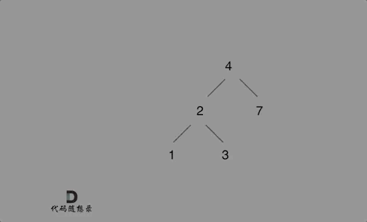

**力扣（701）：**

给定二叉搜索树（BST）的根节点 `root` 和要插入树中的值 `value` ，将值插入二叉搜索树。 返回插入后二叉搜索树的根节点。 输入数据 **保证** ，新值和原始二叉搜索树中的任意节点值都不同。

**注意**，可能存在多种有效的插入方式，只要树在插入后仍保持为二叉搜索树即可。 你可以返回 **任意有效的结果** 。

**示例 1：**


```
输入：root = [4,2,7,1,3], val = 5
输出：[4,2,7,1,3,5]
解释：另一个满足题目要求可以通过的树是：
```


**示例 2：**

```
输入：root = [40,20,60,10,30,50,70], val = 25
输出：[40,20,60,10,30,50,70,null,null,25]
```

**示例 3：**

```
输入：root = [4,2,7,1,3,null,null,null,null,null,null], val = 5
输出：[4,2,7,1,3,5]
```

**提示：**

- 树中的节点数将在 `[0, 104]`的范围内。
- `-108 <= Node.val <= 108`
- 所有值 `Node.val` 是 **独一无二** 的。
- `-108 <= val <= 108`
- **保证** `val` 在原始BST中不存在。


自己写的：

递归：

```cpp
class Solution {
public:
    TreeNode* insertIntoBST(TreeNode* root, int val) {
        if (root == NULL) {
            return new TreeNode(val);
        }

        if (root->left == NULL && root->val > val) {
            TreeNode* node = new TreeNode(val);
            root->left = node;
            return root;
        }
        else if (root->right == NULL && root->val < val) {
            TreeNode* node = new TreeNode(val);
            root->right = node;
            return root;
        }

        if (root->val > val)
            insertIntoBST(root->left, val);
        if (root->val < val)
            insertIntoBST(root->right, val);

        return root;
    }
};
```

自己写的时候没有注意这个：

```cpp
        if (root == NULL) {
            return new TreeNode(val);
        }
```

也就是没有考虑到输入是NULL的情况，经过GPT补充后修改，才通过力扣提交。


迭代法：

```cpp
class Solution {
public:
    TreeNode* insertIntoBST(TreeNode* root, int val) {
        if (root == NULL)
            return new TreeNode(val);

        TreeNode* node = root;

        while (node) {
            if (node->val > val)
                if (node->left)
                    node = node->left;
                else {
                    node->left = new TreeNode(val);
                    break;
                }
            else if (node->val < val)
                if (node->right)
                    node = node->right;
                else {
                    node->right = new TreeNode(val);
                    break;
                }
        }

        return root;
    }
};
```


教学的：

这道题目其实是一道简单题目，**但是题目中的提示：有多种有效的插入方式，还可以重构二叉搜索树，一下子吓退了不少人**，瞬间感觉题目复杂了很多。

其实**可以不考虑题目中提示所说的改变树的结构的插入方式。**

如下演示视频中可以看出：只要按照二叉搜索树的规则去遍历，遇到空节点就插入节点就可以了。



例如插入元素10 ，需要找到末尾节点插入便可，一样的道理来插入元素15，插入元素0，插入元素6，**需要调整二叉树的结构么？ 并不需要。**。

只要遍历二叉搜索树，找到空节点 插入元素就可以了，那么这道题其实就简单了。

接下来就是遍历二叉搜索树的过程了。

### 递归

递归三部曲：

- 确定递归函数参数以及返回值

参数就是根节点指针，以及要插入元素，这里递归函数要不要有返回值呢？

可以有，也可以没有，但递归函数如果没有返回值的话，实现是比较麻烦的，下面也会给出其具体实现代码。

**有返回值的话，可以利用返回值完成新加入的节点与其父节点的赋值操作**。（下面会进一步解释）

递归函数的返回类型为节点类型TreeNode * 。

代码如下：

```cpp
TreeNode* insertIntoBST(TreeNode* root, int val)
```

- 确定终止条件

终止条件就是找到遍历的节点为null的时候，就是要插入节点的位置了，并把插入的节点返回。

代码如下：

```cpp
if (root == NULL) {
    TreeNode* node = new TreeNode(val);
    return node;
}
```

这里把添加的节点返回给上一层，就完成了父子节点的赋值操作了，详细再往下看。

- 确定单层递归的逻辑

此时要明确，需要遍历整棵树么？

别忘了这是搜索树，遍历整棵搜索树简直是对搜索树的侮辱。

搜索树是有方向了，可以根据插入元素的数值，决定递归方向。

代码如下：

```cpp
if (root->val > val) root->left = insertIntoBST(root->left, val);
if (root->val < val) root->right = insertIntoBST(root->right, val);
return root;
```

**到这里应该能感受到，如何通过递归函数返回值完成了新加入节点的父子关系赋值操作了，下一层将加入节点返回，本层用root->left或者root->right将其接住**。

整体代码如下：

```cpp
class Solution {
public:
    TreeNode* insertIntoBST(TreeNode* root, int val) {
        if (root == NULL) {
            TreeNode* node = new TreeNode(val);
            return node;
        }
        if (root->val > val) root->left = insertIntoBST(root->left, val);
        if (root->val < val) root->right = insertIntoBST(root->right, val);
        return root;
    }
};
```

刚刚说了递归函数不用返回值也可以，找到插入的节点位置，直接让其父节点指向插入节点，结束递归，也是可以的。

那么递归函数定义如下：

```cpp
TreeNode* parent; // 记录遍历节点的父节点
void traversal(TreeNode* cur, int val)
```

没有返回值，需要记录上一个节点（parent），遇到空节点了，就让parent左孩子或者右孩子指向新插入的节点。然后结束递归。

代码如下：

```cpp
class Solution {
private:
    TreeNode* parent;
    void traversal(TreeNode* cur, int val) {
        if (cur == NULL) {
            TreeNode* node = new TreeNode(val);
            if (val > parent->val) parent->right = node;
            else parent->left = node;
            return;
        }
        parent = cur;
        if (cur->val > val) traversal(cur->left, val);
        if (cur->val < val) traversal(cur->right, val);
        return;
    }

public:
    TreeNode* insertIntoBST(TreeNode* root, int val) {
        parent = new TreeNode(0);
        if (root == NULL) {
            root = new TreeNode(val);
        }
        traversal(root, val);
        return root;
    }
};
```

可以看出还是麻烦一些的。

### 迭代

在迭代法遍历的过程中，需要记录一下当前遍历的节点的父节点，这样才能做插入节点的操作。

在[二叉树：搜索树的最小绝对差 ](https://programmercarl.com/0530.二叉搜索树的最小绝对差.html)和[二叉树：我的众数是多少？](https://programmercarl.com/0501.二叉搜索树中的众数.html)中，都是用了记录pre和cur两个指针的技巧，本题也是一样的。

代码如下：

```cpp
class Solution {
public:
    TreeNode* insertIntoBST(TreeNode* root, int val) {
        if (root == NULL) {
            TreeNode* node = new TreeNode(val);
            return node;
        }
        TreeNode* cur = root;
        TreeNode* parent = root; // 这个很重要，需要记录上一个节点，否则无法赋值新节点
        while (cur != NULL) {
            parent = cur;
            if (cur->val > val) cur = cur->left;
            else cur = cur->right;
        }
        TreeNode* node = new TreeNode(val);
        if (val < parent->val) parent->left = node;// 此时是用parent节点的进行赋值
        else parent->right = node;
        return root;
    }
};
```


# 总结

认真读题，输入包含了root = NULL 的情况。