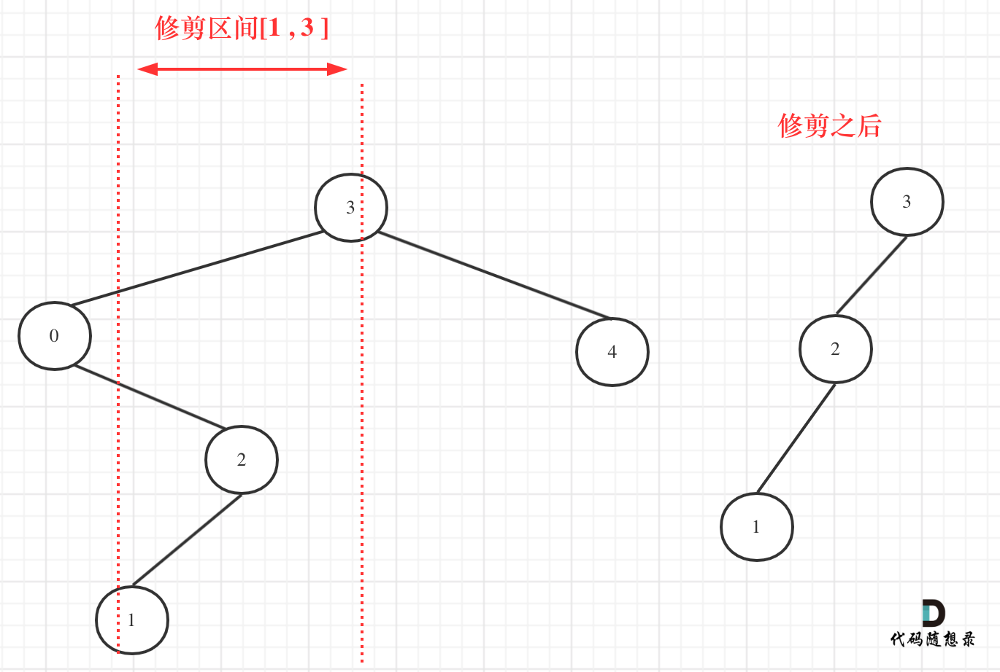

**力扣（669）：**

给你二叉搜索树的根节点 `root` ，同时给定最小边界`low` 和最大边界 `high`。通过修剪二叉搜索树，使得所有节点的值在`[low, high]`中。修剪树 **不应该** 改变保留在树中的元素的相对结构 (即，如果没有被移除，原有的父代子代关系都应当保留)。 可以证明，存在 **唯一的答案** 。

所以结果应当返回修剪好的二叉搜索树的新的根节点。注意，根节点可能会根据给定的边界发生改变。

**示例 1：**


```
输入：root = [1,0,2], low = 1, high = 2
输出：[1,null,2]
```

**示例 2：**


```
输入：root = [3,0,4,null,2,null,null,1], low = 1, high = 3
输出：[3,2,null,1]
```

**提示：**

- 树中节点数在范围 `[1, 10^4]` 内
- `0 <= Node.val <= 10^4`
- 树中每个节点的值都是 **唯一** 的
- 题目数据保证输入是一棵有效的二叉搜索树
- `0 <= low <= high <= 10^4`

### 递归法

直接想法就是：递归处理，然后遇到 `root->val < low || root->val > high` 的时候直接return NULL，一波修改，赶紧利落。

不难写出如下代码：

```cpp
class Solution {
public:
    TreeNode* trimBST(TreeNode* root, int low, int high) {
        if (root == nullptr || root->val < low || root->val > high) return nullptr;
        root->left = trimBST(root->left, low, high);
        root->right = trimBST(root->right, low, high);
        return root;
    }
};
```

**然而[1, 3]区间在二叉搜索树的中可不是单纯的节点3和左孩子节点0就决定的，还要考虑节点0的右子树**。

关注一下第二个示例，如图：



**所以以上的代码是不可行的**

从图中可以看出需要重构二叉树，想想是不是本题就有点复杂了。

其实不用重构那么复杂。

在上图中发现节点0并不符合区间要求，那么将节点0的右孩子 节点2 直接赋给 节点3的左孩子就可以了（就是把节点0从二叉树中移除），如图：


理解了最关键部分了再递归三部曲：

- 确定递归函数的参数以及返回值

这里为什么需要返回值呢？

因为是要遍历整棵树，做修改，其实不需要返回值也可以，我们也可以完成修剪（其实就是从二叉树中移除节点）的操作。

但是有返回值，更方便，可以通过递归函数的返回值来移除节点。

代码如下：

```cpp
TreeNode* trimBST(TreeNode* root, int low, int high)
```

- 确定终止条件

修剪的操作并不是在终止条件上进行的，所以就是遇到空节点返回就可以了。

```cpp
if (root == nullptr ) return nullptr;
```

- 确定单层递归的逻辑

如果root（当前节点）的元素小于low的数值，那么应该递归右子树，并返回右子树符合条件的头结点。

代码如下：

```cpp
if (root->val < low) {
    TreeNode* right = trimBST(root->right, low, high); // 寻找符合区间[low, high]的节点
    return right;
}
```

如果root(当前节点)的元素大于high的，那么应该递归左子树，并返回左子树符合条件的头结点。

代码如下：

```cpp
if (root->val > high) {
    TreeNode* left = trimBST(root->left, low, high); // 寻找符合区间[low, high]的节点
    return left;
}
```

接下来要将下一层处理完左子树的结果赋给root->left，处理完右子树的结果赋给root->right。

最后返回root节点，代码如下：

```cpp
root->left = trimBST(root->left, low, high); // root->left接入符合条件的左孩子
root->right = trimBST(root->right, low, high); // root->right接入符合条件的右孩子
return root;
```

此时是不是还没发现这多余的节点究竟是如何从二叉树中移除的呢？

在回顾一下上面的代码，针对下图中二叉树的情况：


如下代码相当于把节点0的右孩子（节点2）返回给上一层，

```cpp
if (root->val < low) {
    TreeNode* right = trimBST(root->right, low, high); // 寻找符合区间[low, high]的节点
    return right;
}
```

然后如下代码相当于用节点3的左孩子 把下一层返回的 节点0的右孩子（节点2） 接住。

```cpp
root->left = trimBST(root->left, low, high);
```

此时节点3的左孩子就变成了节点2，将节点0从二叉树中移除了。

最后整体代码如下：

```cpp
class Solution {
public:
    TreeNode* trimBST(TreeNode* root, int low, int high) {
        if (root == nullptr ) return nullptr;
        if (root->val < low) {
            TreeNode* right = trimBST(root->right, low, high); // 寻找符合区间[low, high]的节点
            return right;
        }
        if (root->val > high) {
            TreeNode* left = trimBST(root->left, low, high); // 寻找符合区间[low, high]的节点
            return left;
        }
        root->left = trimBST(root->left, low, high); // root->left接入符合条件的左孩子
        root->right = trimBST(root->right, low, high); // root->right接入符合条件的右孩子
        return root;
    }
};
```

精简之后代码如下：

```cpp
class Solution {
public:
    TreeNode* trimBST(TreeNode* root, int low, int high) {
        if (root == nullptr) return nullptr;
        if (root->val < low) return trimBST(root->right, low, high);
        if (root->val > high) return trimBST(root->left, low, high);
        root->left = trimBST(root->left, low, high);
        root->right = trimBST(root->right, low, high);
        return root;
    }
};
```


### 迭代法

因为二叉搜索树的有序性，不需要使用栈模拟递归的过程。

在剪枝的时候，可以分为三步：

- 将root移动到[L, R] 范围内，注意是左闭右闭区间
- 剪枝左子树
- 剪枝右子树

代码如下：

```cpp
class Solution {
public:
    TreeNode* trimBST(TreeNode* root, int L, int R) {
        if (!root) return nullptr;

        // 处理头结点，让root移动到[L, R] 范围内，注意是左闭右闭
        while (root != nullptr && (root->val < L || root->val > R)) {
            if (root->val < L) root = root->right; // 小于L往右走
            else root = root->left; // 大于R往左走
        }
        TreeNode *cur = root;
        // 此时root已经在[L, R] 范围内，处理左孩子元素小于L的情况
        while (cur != nullptr) {
            while (cur->left && cur->left->val < L) {
                cur->left = cur->left->right;
            }
            cur = cur->left;
        }
        cur = root;

        // 此时root已经在[L, R] 范围内，处理右孩子大于R的情况
        while (cur != nullptr) {
            while (cur->right && cur->right->val > R) {
                cur->right = cur->right->left;
            }
            cur = cur->right;
        }
        return root;
    }
};
```


## 总结

修剪二叉搜索树其实并不难，但在递归法中大家可看出我费了很大的功夫来讲解如何删除节点的，这个思路其实是比较绕的。

最终的代码倒是很简洁。

**如果不对递归有深刻的理解，这道题目还是有难度的**