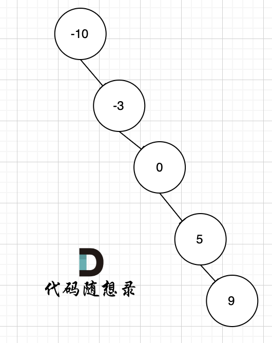

**力扣（108）：**

给你一个整数数组 `nums` ，其中元素已经按 **升序** 排列，请你将其转换为一棵 平衡 二叉搜索树。

**示例 1：**


```
输入：nums = [-10,-3,0,5,9]
输出：[0,-3,9,-10,null,5]
解释：[0,-10,5,null,-3,null,9] 也将被视为正确答案：
```


**示例 2：**


```
输入：nums = [1,3]
输出：[3,1]
解释：[1,null,3] 和 [3,1] 都是高度平衡二叉搜索树。
```

**提示：**

- `1 <= nums.length <= 10^4`
- `-10^4 <= nums[i] <= 10^4`
- `nums` 按 **严格递增** 顺序排列


题目中说要转换为一棵高度平衡二叉搜索树。为什么强调要平衡呢？

因为只要给我们一个有序数组，如果不强调平衡，都可以以线性结构来构造二叉搜索树。

例如 有序数组[-10，-3，0，5，9] 就可以构造成这样的二叉搜索树，如图。



上图中，是符合二叉搜索树的特性吧，如果要这么做的话，是不是本题意义就不大了，所以才强调是平衡二叉搜索树。

其实数组构造二叉树，构成平衡树是自然而然的事情，因为大家默认都是从数组中间位置取值作为节点元素，一般不会随机取。**所以想构成不平衡的二叉树是自找麻烦**。

之前已经讲过了，如果根据数组构造一棵二叉树，**本质就是寻找分割点，分割点作为当前节点，然后递归左区间和右区间**。

分割点就是数组中间位置的节点。

那么为问题来了，如果数组长度为偶数，中间节点有两个，取哪一个？

取哪一个都可以，只不过构成了不同的平衡二叉搜索树。

例如：输入：[-10,-3,0,5,9]

如下两棵树，都是这个数组的平衡二叉搜索树：


如果要分割的数组长度为偶数的时候，中间元素为两个，是取左边元素 就是树1，取右边元素就是树2。

**这也是题目中强调答案不是唯一的原因。 理解这一点，这道题目算是理解到位了**。

### 递归

递归三部曲：

- 确定递归函数返回值及其参数

删除二叉树节点，增加二叉树节点，都是用递归函数的返回值来完成，这样是比较方便的。

那么本题要构造二叉树，依然用递归函数的返回值来构造中节点的左右孩子。

再来看参数，首先是传入数组，然后就是左下标left和右下标right，之前提过，在构造二叉树的时候尽量不要重新定义左右区间数组，而是用下标来操作原数组。

所以代码如下：

```text
// 左闭右闭区间[left, right]
TreeNode* traversal(vector<int>& nums, int left, int right)
```

这里注意**定义的是左闭右闭区间，在不断分割的过程中，也会坚持左闭右闭的区间，这又涉及到讲过的循环不变量**。

- 确定递归终止条件

这里定义的是左闭右闭的区间，所以当区间 left > right的时候，就是空节点了。

代码如下：

```text
if (left > right) return nullptr;
```

- 确定单层递归的逻辑

首先取数组中间元素的位置，不难写出`int mid = (left + right) / 2;`，**这么写其实有一个问题，就是数值越界，例如left和right都是最大int，这么操作就越界了，在[二分法 ](https://programmercarl.com/0035.搜索插入位置.html)中尤其需要注意！**

所以可以这么写：`int mid = left + ((right - left) / 2);`

但本题leetcode的测试数据并不会越界，所以怎么写都可以。但需要有这个意识！

取了中间位置，就开始以中间位置的元素构造节点，代码：`TreeNode* root = new TreeNode(nums[mid]);`。

接着划分区间，root的左孩子接住下一层左区间的构造节点，右孩子接住下一层右区间构造的节点。

最后返回root节点，单层递归整体代码如下：

```text
int mid = left + ((right - left) / 2);
TreeNode* root = new TreeNode(nums[mid]);
root->left = traversal(nums, left, mid - 1);
root->right = traversal(nums, mid + 1, right);
return root;
```

这里`int mid = left + ((right - left) / 2);`的写法相当于是如果数组长度为偶数，中间位置有两个元素，取靠左边的。

- 递归整体代码如下：

```cpp
class Solution {
private:
    TreeNode* traversal(vector<int>& nums, int left, int right) {
        if (left > right) return nullptr;
        int mid = left + ((right - left) / 2);
        TreeNode* root = new TreeNode(nums[mid]);
        root->left = traversal(nums, left, mid - 1);
        root->right = traversal(nums, mid + 1, right);
        return root;
    }
public:
    TreeNode* sortedArrayToBST(vector<int>& nums) {
        TreeNode* root = traversal(nums, 0, nums.size() - 1);
        return root;
    }
};
```

**注意：在调用traversal的时候传入的left和right为什么是0和nums.size() - 1，因为定义的区间为左闭右闭**。


### 迭代法

迭代法可以通过三个队列来模拟，一个队列放遍历的节点，一个队列放左区间下标，一个队列放右区间下标。

模拟的就是不断分割的过程，C++代码如下：（我已经详细注释）

```cpp
class Solution {
public:
    TreeNode* sortedArrayToBST(vector<int>& nums) {
        if (nums.size() == 0) return nullptr;

        TreeNode* root = new TreeNode(0);   // 初始根节点
        queue<TreeNode*> nodeQue;           // 放遍历的节点
        queue<int> leftQue;                 // 保存左区间下标
        queue<int> rightQue;                // 保存右区间下标
        nodeQue.push(root);                 // 根节点入队列
        leftQue.push(0);                    // 0为左区间下标初始位置
        rightQue.push(nums.size() - 1);     // nums.size() - 1为右区间下标初始位置

        while (!nodeQue.empty()) {
            TreeNode* curNode = nodeQue.front();
            nodeQue.pop();
            int left = leftQue.front(); leftQue.pop();
            int right = rightQue.front(); rightQue.pop();
            int mid = left + ((right - left) / 2);

            curNode->val = nums[mid];       // 将mid对应的元素给中间节点

            if (left <= mid - 1) {          // 处理左区间
                curNode->left = new TreeNode(0);
                nodeQue.push(curNode->left);
                leftQue.push(left);
                rightQue.push(mid - 1);
            }

            if (right >= mid + 1) {         // 处理右区间
                curNode->right = new TreeNode(0);
                nodeQue.push(curNode->right);
                leftQue.push(mid + 1);
                rightQue.push(right);
            }
        }
        return root;
    }
};
```


# 总结

二叉树写的有点麻了，以后再刷题感觉需要时不时换种类型的题目