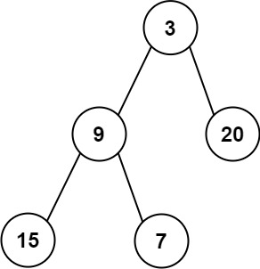

**力扣（637）：**

给定一个非空二叉树的根节点 `root` , 以数组的形式返回每一层节点的平均值。与实际答案相差 `10-5` 以内的答案可以被接受。

**示例 1：**


```
输入：root = [3,9,20,null,null,15,7]
输出：[3.00000,14.50000,11.00000]
解释：第 0 层的平均值为 3,第 1 层的平均值为 14.5,第 2 层的平均值为 11 。
因此返回 [3, 14.5, 11] 。
```

**示例 2:**



```
输入：root = [3,9,20,15,7]
输出：[3.00000,14.50000,11.00000]
```

**提示：**

- 树中节点数量在 `[1, 104]` 范围内
- `-231 <= Node.val <= 231 - 1`


自己写的：

```cpp
class Solution {
public:
	vector<double> averageOfLevels(TreeNode* root) {
		queue<TreeNode*> que;
		if (root != NULL)
			que.push(root);
		vector<double> result;
		while (!que.empty()) {
			int size = que.size();
			long int tmp_sum = 0;
			for (int i = 0; i < size; ++i) {
				TreeNode* node = que.front();
				que.pop();
				tmp_sum += node->val;
				if (i == size - 1)  //遍历到这一层最后一个数的时候就可以算平均值了
					result.push_back(1.0 * tmp_sum / size);   //记得先乘一个1.0变换数据类型
				if (node->left)
					que.push(node->left);
				if (node->right)
					que.push(node->right);
			}
		}

		return result;
	}
};
```

算每一层数据的总和时用了数据类型long int，一开始用的int，但是在力扣运行报错提示超出范围，换了之后就通过了


教学上的：

本题就是层序遍历的时候把一层求个总和在取一个均值。

```cpp
class Solution {
public:
    vector<double> averageOfLevels(TreeNode* root) {
        queue<TreeNode*> que;
        if (root != NULL) que.push(root);
        vector<double> result;
        while (!que.empty()) {
            int size = que.size();
            double sum = 0; // 统计每一层的和
            for (int i = 0; i < size; i++) {
                TreeNode* node = que.front();
                que.pop();
                sum += node->val;
                if (node->left) que.push(node->left);
                if (node->right) que.push(node->right);
            }
            result.push_back(sum / size); // 将每一层均值放进结果集
        }
        return result;
    }
};
```

