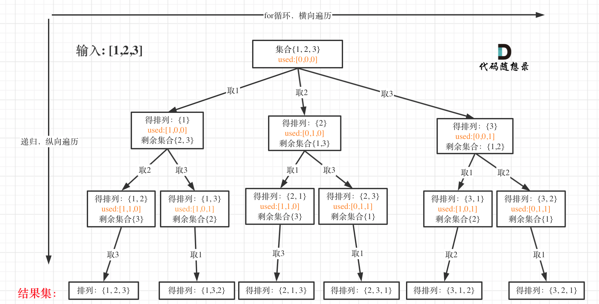

**力扣（46）：**

给定一个不含重复数字的数组 `nums` ，返回其 *所有可能的全排列* 。你可以 **按任意顺序** 返回答案。

**示例 1：**

```
输入：nums = [1,2,3]
输出：[[1,2,3],[1,3,2],[2,1,3],[2,3,1],[3,1,2],[3,2,1]]
```

**示例 2：**

```
输入：nums = [0,1]
输出：[[0,1],[1,0]]
```

**示例 3：**

```
输入：nums = [1]
输出：[[1]]
```

**提示：**

- `1 <= nums.length <= 6`
- `-10 <= nums[i] <= 10`
- `nums` 中的所有整数 **互不相同**


此时已经学习了[77.组合问题 ](https://programmercarl.com/0077.组合.html)、 [131.分割回文串 ](https://programmercarl.com/0131.分割回文串.html)和[78.子集问题 ](https://programmercarl.com/0078.子集.html)，接下来看一看排列问题。

相信这个排列问题就算是用for循环暴力把结果搜索出来，这个暴力也不是很好写。

以[1,2,3]为例，抽象成树形结构如下：



### 回溯三部曲

- 递归函数参数

**首先排列是有序的，也就是说 [1,2] 和 [2,1] 是两个集合，这和之前分析的子集以及组合所不同的地方**。

可以看出元素1在[1,2]中已经使用过了，但是在[2,1]中还要在使用一次1，所以处理排列问题就不用使用startIndex了。

但排列问题需要一个used数组，标记已经选择的元素，如图橘黄色部分所示:

代码如下：

```cpp
vector<vector<int>> result;
vector<int> path;
void backtracking (vector<int>& nums, vector<bool>& used)
```

- 递归终止条件

可以看出叶子节点，就是收割结果的地方。

那么什么时候，算是到达叶子节点呢？

当收集元素的数组path的大小达到和nums数组一样大的时候，说明找到了一个全排列，也表示到达了叶子节点。

代码如下：

```cpp
// 此时说明找到了一组
if (path.size() == nums.size()) {
    result.push_back(path);
    return;
}
```

- 单层搜索的逻辑

这里和[77.组合问题](https://programmercarl.com/0077.组合.html)、[131.切割问题 ](https://programmercarl.com/0131.分割回文串.html)和[78.子集问题](https://programmercarl.com/0078.子集.html)最大的不同就是for循环里不用startIndex了。

因为排列问题，每次都要从头开始搜索，例如元素1在[1,2]中已经使用过了，但是在[2,1]中还要再使用一次1。

**而used数组，其实就是记录此时path里都有哪些元素使用了，一个排列里一个元素只能使用一次**。

代码如下：

```cpp
for (int i = 0; i < nums.size(); i++) {
    if (used[i] == true) continue; // path里已经收录的元素，直接跳过
    used[i] = true;
    path.push_back(nums[i]);
    backtracking(nums, used);
    path.pop_back();
    used[i] = false;
}
```

整体C++代码如下：

```cpp
class Solution {
public:
    vector<vector<int>> result;
    vector<int> path;
    void backtracking (vector<int>& nums, vector<bool>& used) {
        // 此时说明找到了一组
        if (path.size() == nums.size()) {
            result.push_back(path);
            return;
        }
        for (int i = 0; i < nums.size(); i++) {
            if (used[i] == true) continue; // path里已经收录的元素，直接跳过
            used[i] = true;
            path.push_back(nums[i]);
            backtracking(nums, used);
            path.pop_back();
            used[i] = false;
        }
    }
    vector<vector<int>> permute(vector<int>& nums) {
        result.clear();
        path.clear();
        vector<bool> used(nums.size(), false);
        backtracking(nums, used);
        return result;
    }
};
```

- 时间复杂度: O(n!)
- 空间复杂度: O(n)


## 总结

排列问题的不同：

- 每层都是从0开始搜索而不是startIndex
- 需要used数组记录path里都放了哪些元素了

排列问题是回溯算法解决的经典题目