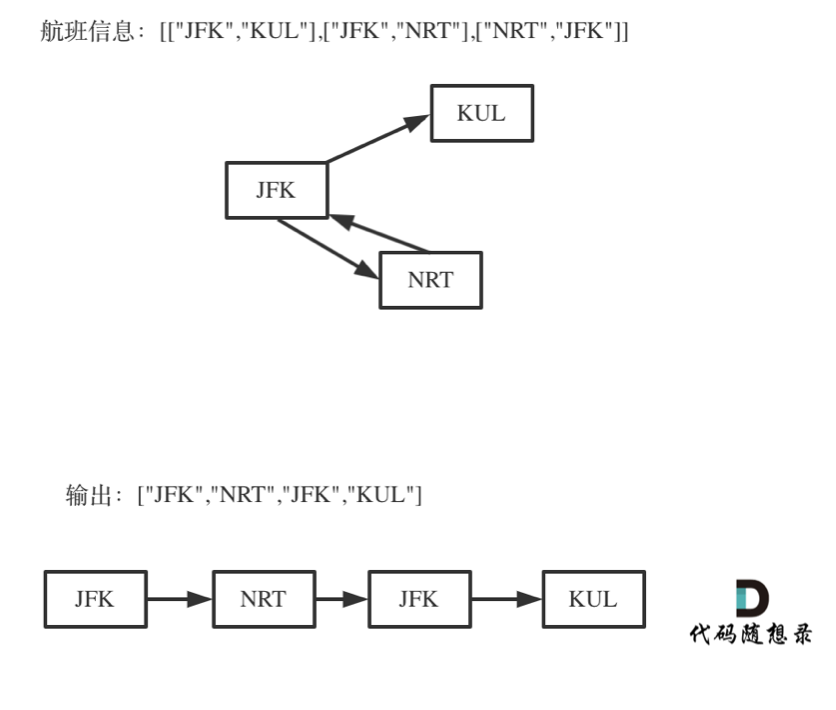

**力扣（332）：**

给你一份航线列表 `tickets` ，其中 `tickets[i] = [fromi, toi]` 表示飞机出发和降落的机场地点。请你对该行程进行重新规划排序。

所有这些机票都属于一个从 `JFK`（肯尼迪国际机场）出发的先生，所以该行程必须从 `JFK` 开始。如果存在多种有效的行程，请你按字典排序返回最小的行程组合。

- 例如，行程 `["JFK", "LGA"]` 与 `["JFK", "LGB"]` 相比就更小，排序更靠前。

假定所有机票至少存在一种合理的行程。且所有的机票 必须都用一次 且 只能用一次。


```
输入：tickets = [["MUC","LHR"],["JFK","MUC"],["SFO","SJC"],["LHR","SFO"]]
输出：["JFK","MUC","LHR","SFO","SJC"]
```

**示例 2：**


```
输入：tickets = [["JFK","SFO"],["JFK","ATL"],["SFO","ATL"],["ATL","JFK"],["ATL","SFO"]]
输出：["JFK","ATL","JFK","SFO","ATL","SFO"]
解释：另一种有效的行程是 ["JFK","SFO","ATL","JFK","ATL","SFO"] ，但是它字典排序更大更靠后。
```

 

**提示：**

- `1 <= tickets.length <= 300`
- `tickets[i].length == 2`
- `fromi.length == 3`
- `toi.length == 3`
- `fromi` 和 `toi` 由大写英文字母组成
- `fromi != toi`


直觉上来看 这道题和回溯法没有什么关系，更像是图论中的深度优先搜索。

实际上确实是深搜，但这是深搜中使用了回溯的例子，在查找路径的时候，如果不回溯，怎么能查到目标路径呢。

所以倾向于说本题应该使用回溯法，那么用回溯法的思路来讲解本题，其实深搜一般都使用了回溯法的思路，在图论系列中会再详细讲解深搜。

**这道题目有几个难点：**

1. 一个行程中，如果航班处理不好容易变成一个圈，成为死循环
2. 有多种解法，字母序靠前排在前面，如何该记录映射关系呢 ？
3. 使用回溯法（也可以说深搜） 的话，那么终止条件是什么呢？
4. 搜索的过程中，如何遍历一个机场所对应的所有机场。

### 如何理解死循环

对于死循环，举一个有重复机场的例子：



出发机场和到达机场也会重复的，**如果在解题的过程中没有对集合元素处理好，就会死循环。**

### 该记录映射关系

有多种解法，字母序靠前排在前面，如何该记录映射关系呢 ？

一个机场映射多个机场，机场之间要靠字母序排列，一个机场映射多个机场，可以使用std::unordered_map，如果让多个机场之间再有顺序的话，就是用std::map 或者std::multimap 或者 std::multiset。

忘了可以看这篇文章[关于哈希表，你该了解这些！](https://programmercarl.com/哈希表理论基础.html)。

这样存放映射关系可以定义为 `unordered_map<string, multiset<string>> targets` 或者 `unordered_map<string, map<string, int>> targets`。

含义如下：

unordered_map<string, multiset> targets：unordered_map<出发机场, 到达机场的集合> targets

unordered_map<string, map<string, int>> targets：unordered_map<出发机场, map<到达机场, 航班次数>> targets

这两个结构，这里选择了后者，因为如果使用`unordered_map<string, multiset<string>> targets` 遍历multiset的时候，不能删除元素，一旦删除元素，迭代器就失效了。

**再说一下为什么一定要增删元素呢，正如开篇给出的图中所示，出发机场和到达机场是会重复的，搜索的过程没及时删除目的机场就会死循环。**

所以搜索的过程中就是要不断的删multiset里的元素，那么推荐使用`unordered_map<string, map<string, int>> targets`。

在遍历 `unordered_map<出发机场, map<到达机场, 航班次数>> targets`的过程中，**可以使用"航班次数"这个字段的数字做相应的增减，来标记到达机场是否使用过了。**

如果“航班次数”大于零，说明目的地还可以飞，如果“航班次数”等于零说明目的地不能飞了，而不用对集合做删除元素或者增加元素的操作。

**相当于说不删，就做一个标记！**

### 回溯法

这道题目我使用回溯法，那么下面按照我总结的回溯模板来：

```text
void backtracking(参数) {
    if (终止条件) {
        存放结果;
        return;
    }

    for (选择：本层集合中元素（树中节点孩子的数量就是集合的大小）) {
        处理节点;
        backtracking(路径，选择列表); // 递归
        回溯，撤销处理结果
    }
}
```

本题以输入：[["JFK", "KUL"], ["JFK", "NRT"], ["NRT", "JFK"]为例，抽象为树形结构如下：


开始回溯三部曲讲解：

- 递归函数参数

在讲解映射关系的时候，已经讲过了，使用`unordered_map<string, map<string, int>> targets;` 来记录航班的映射关系，定义为全局变量。

当然把参数放进函数里传进去也是可以的，这里尽量控制函数里参数的长度。

参数里还需要ticketNum，表示有多少个航班（终止条件会用上）。

代码如下：

```cpp
// unordered_map<出发机场, map<到达机场, 航班次数>> targets
unordered_map<string, map<string, int>> targets;
bool backtracking(int ticketNum, vector<string>& result) {
```

**注意函数返回值用的是bool！**

之前讲解回溯算法的时候，一般函数返回值都是void，这次为什么是bool呢？

因为只需要找到一个行程，就是在树形结构中唯一的一条通向叶子节点的路线，如图：


所以找到这个叶子节点了直接返回，这个递归函数的返回值问题在讲解二叉树的系列的时候，在这篇[二叉树：递归函数究竟什么时候需要返回值，什么时候不要返回值？](https://programmercarl.com/0112.路径总和.html)详细介绍过。

当然本题的targets和result都需要初始化，代码如下：

```cpp
for (const vector<string>& vec : tickets) {
    targets[vec[0]][vec[1]]++; // 记录映射关系
}
result.push_back("JFK"); // 起始机场
```

- 递归终止条件

拿题目中的示例为例，输入: [["MUC", "LHR"], ["JFK", "MUC"], ["SFO", "SJC"], ["LHR", "SFO"]] ，这是有4个航班，那么只要找出一种行程，行程里的机场个数是5就可以了。

所以终止条件是：回溯遍历的过程中，遇到的机场个数，如果达到了（航班数量+1），那么就找到了一个行程，把所有航班串在一起了。

代码如下：

```cpp
if (result.size() == ticketNum + 1) {
    return true;
}
```

已经看习惯回溯法代码，到叶子节点了习惯性的想要收集结果，但发现并不需要，本题的result相当于 [回溯算法：求组合总和！](https://programmercarl.com/0216.组合总和III.html)中的path，也就是本题的result就是记录路径的（就一条），在如下单层搜索的逻辑中result就添加元素了。

- 单层搜索的逻辑

回溯的过程中，如何遍历一个机场所对应的所有机场呢？

这里刚刚说过，在选择映射函数的时候，不能选择`unordered_map<string, multiset<string>> targets`， 因为一旦有元素增删multiset的迭代器就会失效，当然可能有牛逼的容器删除元素迭代器不会失效，这里就不在讨论了。

**可以说本题既要找到一个对数据进行排序的容器，而且还要容易增删元素，迭代器还不能失效**。

所以选择了`unordered_map<string, map<string, int>> targets` 来做机场之间的映射。

遍历过程如下：

```cpp
for (pair<const string, int>& target : targets[result[result.size() - 1]]) {
    if (target.second > 0 ) { // 记录到达机场是否飞过了
        result.push_back(target.first);
        target.second--;
        if (backtracking(ticketNum, result)) return true;
        result.pop_back();
        target.second++;
    }
}
```

可以看出 通过`unordered_map<string, map<string, int>> targets`里的int字段来判断 这个集合里的机场是否使用过，这样避免了直接去删元素。

分析完毕，此时完整C++代码如下：

```cpp
class Solution {
private:
// unordered_map<出发机场, map<到达机场, 航班次数>> targets
unordered_map<string, map<string, int>> targets;
bool backtracking(int ticketNum, vector<string>& result) {
    if (result.size() == ticketNum + 1) {
        return true;
    }
    for (pair<const string, int>& target : targets[result[result.size() - 1]]) {
        if (target.second > 0 ) { // 记录到达机场是否飞过了
            result.push_back(target.first);
            target.second--;
            if (backtracking(ticketNum, result)) return true;
            result.pop_back();
            target.second++;
        }
    }
    return false;
}
public:
    vector<string> findItinerary(vector<vector<string>>& tickets) {
        targets.clear();
        vector<string> result;
        for (const vector<string>& vec : tickets) {
            targets[vec[0]][vec[1]]++; // 记录映射关系
        }
        result.push_back("JFK"); // 起始机场
        backtracking(tickets.size(), result);
        return result;
    }
};
```

代码中

```cpp
for (pair<const string, int>& target : targets[result[result.size() - 1]])
```

一定要加上引用即 `& target`，因为后面有对 target.second 做减减操作，如果没有引用，单纯复制，这个结果就没记录下来，那最后的结果就不对了。

加上引用之后，就必须在 string 前面加上 const，因为map中的key 是不可修改了，这就是语法规定了。


# 总结

很难的题，其实能想到用啥容器合适就能有比较好的思路了。要善于利用好STL。