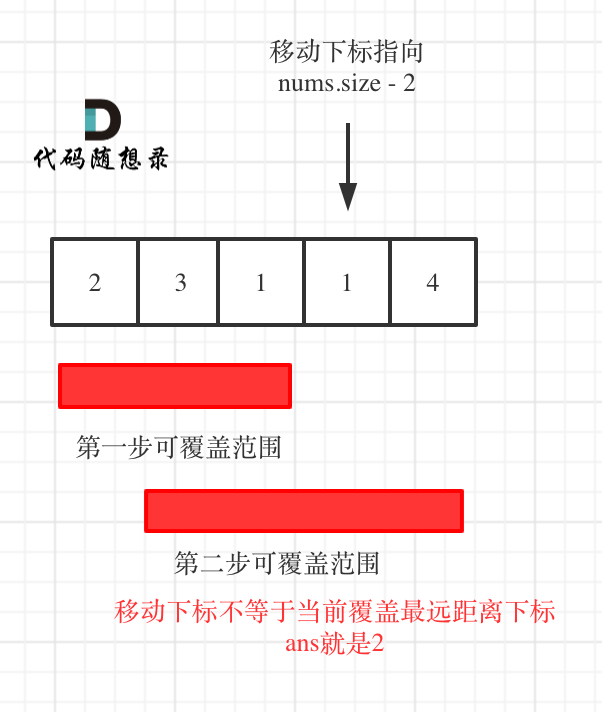

**力扣（45）：**

给定一个长度为 `n` 的 **0 索引**整数数组 `nums`。初始位置为 `nums[0]`。

每个元素 `nums[i]` 表示从索引 `i` 向前跳转的最大长度。换句话说，如果你在 `nums[i]` 处，你可以跳转到任意 `nums[i + j]` 处:

- `0 <= j <= nums[i]` 
- `i + j < n`

返回到达 `nums[n - 1]` 的最小跳跃次数。生成的测试用例可以到达 `nums[n - 1]`。

**示例 1:**

```
输入: nums = [2,3,1,1,4]
输出: 2
解释: 跳到最后一个位置的最小跳跃数是 2。
     从下标为 0 跳到下标为 1 的位置，跳 1 步，然后跳 3 步到达数组的最后一个位置。
```

**示例 2:**

```
输入: nums = [2,3,0,1,4]
输出: 2
```

**提示:**

- `1 <= nums.length <= 10^4`
- `0 <= nums[i] <= 1000`
- 题目保证可以到达 `nums[n-1]`


本题相对于[55.跳跃游戏 ](https://programmercarl.com/0055.跳跃游戏.html)还是难了不少。

但思路是相似的，还是要看最大覆盖范围。

本题要计算最少步数，那么就要想清楚什么时候步数才一定要加一呢？

贪心的思路，局部最优：当前可移动距离尽可能多走，如果还没到终点，步数再加一。整体最优：一步尽可能多走，从而达到最少步数。

思路虽然是这样，但在写代码的时候还不能真的能跳多远就跳多远，那样就不知道下一步最远能跳到哪里了。

**所以真正解题的时候，要从覆盖范围出发，不管怎么跳，覆盖范围内一定是可以跳到的，以最小的步数增加覆盖范围，覆盖范围一旦覆盖了终点，得到的就是最少步数！**

**这里需要统计两个覆盖范围，当前这一步的最大覆盖和下一步最大覆盖**。

如果移动下标达到了当前这一步的最大覆盖最远距离了，还没有到终点的话，那么就必须再走一步来增加覆盖范围，直到覆盖范围覆盖了终点。

如图：


**图中覆盖范围的意义在于，只要红色的区域，最多两步一定可以到！（不用管具体怎么跳，反正一定可以跳到）**

### 方法一

从图中可以看出来，就是移动下标达到了当前覆盖的最远距离下标时，步数就要加一，来增加覆盖距离。最后的步数就是最少步数。

这里还是有个特殊情况需要考虑，当移动下标达到了当前覆盖的最远距离下标时

- 如果当前覆盖最远距离下标不是是集合终点，步数就加一，还需要继续走。
- 如果当前覆盖最远距离下标就是是集合终点，步数不用加一，因为不能再往后走了。

C++代码如下：（详细注释）

```cpp
// 版本一
class Solution {
public:
    int jump(vector<int>& nums) {
        if (nums.size() == 1) return 0;
        int curDistance = 0;    // 当前覆盖最远距离下标
        int ans = 0;            // 记录走的最大步数
        int nextDistance = 0;   // 下一步覆盖最远距离下标
        for (int i = 0; i < nums.size(); i++) {
            nextDistance = max(nums[i] + i, nextDistance);  // 更新下一步覆盖最远距离下标
            if (i == curDistance) {                         // 遇到当前覆盖最远距离下标
                ans++;                                  // 需要走下一步
                curDistance = nextDistance;             // 更新当前覆盖最远距离下标（相当于加油了）
                if (nextDistance >= nums.size() - 1) break;  // 当前覆盖最远距到达集合终点，不用做ans++操作了，直接结束
            }
        }
        return ans;
    }
};
```

- 时间复杂度: O(n)
- 空间复杂度: O(1)

### 方法二

依然是贪心，思路和方法一差不多，代码可以简洁一些。

**针对于方法一的特殊情况，可以统一处理**，即：移动下标只要遇到当前覆盖最远距离的下标，直接步数加一，不考虑是不是终点的情况。

想要达到这样的效果，只要让移动下标，最大只能移动到 nums.size - 2 的地方就可以了。

因为当移动下标指向 nums.size - 2 时：

- 如果移动下标等于当前覆盖最大距离下标， 需要再走一步（即 ans++），因为最后一步一定是可以到的终点。（题目假设总是可以到达数组的最后一个位置），如图：


- 如果移动下标不等于当前覆盖最大距离下标，说明当前覆盖最远距离就可以直接达到终点了，不需要再走一步。如图：



代码如下：

```cpp
// 版本二
class Solution {
public:
    int jump(vector<int>& nums) {
        int curDistance = 0;    // 当前覆盖的最远距离下标
        int ans = 0;            // 记录走的最大步数
        int nextDistance = 0;   // 下一步覆盖的最远距离下标
        for (int i = 0; i < nums.size() - 1; i++) { // 注意这里是小于nums.size() - 1，这是关键所在
            nextDistance = max(nums[i] + i, nextDistance); // 更新下一步覆盖的最远距离下标
            if (i == curDistance) {                 // 遇到当前覆盖的最远距离下标
                curDistance = nextDistance;         // 更新当前覆盖的最远距离下标
                ans++;
            }
        }
        return ans;
    }
};
```

- 时间复杂度: O(n)
- 空间复杂度: O(1)

可以看出版本二的代码相对于版本一简化了不少！

**其精髓在于控制移动下标 i 只移动到 nums.size() - 2 的位置**，所以移动下标只要遇到当前覆盖最远距离的下标，直接步数加一，不用考虑别的了。