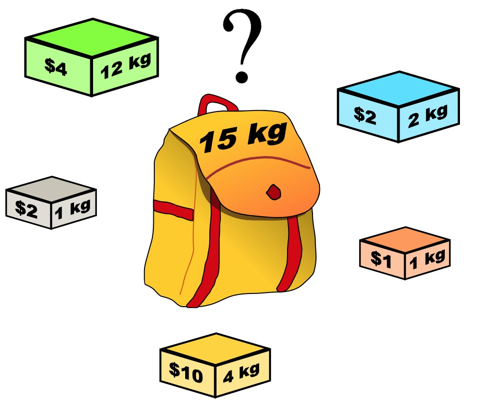

**卡码网（46）：**

小明是一位科学家，他需要参加一场重要的国际科学大会，以展示自己的最新研究成果。他需要带一些研究材料，但是他的行李箱空间有限。这些研究材料包括实验设备、文献资料和实验样本等等，它们各自占据不同的空间，并且具有不同的价值。 

小明的行李空间为 N，问小明应该如何抉择，才能携带最大价值的研究材料，每种研究材料只能选择一次，并且只有选与不选两种选择，不能进行切割。

###### 输入描述

第一行包含两个正整数，第一个整数 M 代表研究材料的种类，第二个正整数 N，代表小明的行李空间。

第二行包含 M 个正整数，代表每种研究材料的所占空间。 

第三行包含 M 个正整数，代表每种研究材料的价值。

###### 输出描述

输出一个整数，代表小明能够携带的研究材料的最大价值。

###### 输入示例

```
6 1
2 2 3 1 5 2
2 3 1 5 4 3
```

###### 输出示例

```
5
```

###### 提示信息

小明能够携带 6 种研究材料，但是行李空间只有 1，而占用空间为 1 的研究材料价值为 5，所以最终答案输出 5。 

数据范围：
1 <= N <= 5000
1 <= M <= 5000
研究材料占用空间和价值都小于等于 1000


对于面试的话，其实掌握01背包，和完全背包，就够用了，最多可以再来一个多重背包。

如果这几种背包，分不清，我这里画了一个图，如下：


至于背包九讲其他背包，面试几乎不会问，都是竞赛级别的了，leetcode上连多重背包的题目都没有，所以题库也告诉我们，01背包和完全背包就够用了。

而完全背包又是也是01背包稍作变化而来，即：完全背包的物品数量是无限的。

**所以背包问题的理论基础重中之重是01背包，一定要理解透！**

leetcode上没有纯01背包的问题，都是01背包应用方面的题目，也就是需要转化为01背包问题。

**所以我先通过纯01背包问题，把01背包原理讲清楚，后续再讲解leetcode题目的时候，重点就是讲解如何转化为01背包问题了**。

### 01 背包

有n件物品和一个最多能背重量为w 的背包。第i件物品的重量是weight[i]，得到的价值是value[i] 。**每件物品只能用一次**，求解将哪些物品装入背包里物品价值总和最大。



这是标准的背包问题，以至于很多同学看了这个自然就会想到背包，甚至都不知道暴力的解法应该怎么解了。

这样其实是没有从底向上去思考，而是习惯性想到了背包，那么暴力的解法应该是怎么样的呢？

每一件物品其实只有两个状态，取或者不取，所以可以使用回溯法搜索出所有的情况，那么时间复杂度就是o(2^n)，这里的n表示物品数量。

**所以暴力的解法是指数级别的时间复杂度。进而才需要动态规划的解法来进行优化！**

在下面的讲解中，我举一个例子：

背包最大重量为4。

物品为：

|       | 重量 | 价值 |
| ----- | ---- | ---- |
| 物品0 | 1    | 15   |
| 物品1 | 3    | 20   |
| 物品2 | 4    | 30   |

问背包能背的物品最大价值是多少？

以下讲解和图示中出现的数字都是以这个例子为例。

### 二维dp数组01背包

依然动规五部曲分析一波。

1.确定dp数组以及下标的含义

对于背包问题，有一种写法， 是使用二维数组，即**`dp[i][j]` 表示从下标为[0-i]的物品里任意取，放进容量为j的背包，价值总和最大是多少**。

只看这个二维数组的定义，大家一定会有点懵，看下面这个图：


**要时刻记着这个dp数组的含义，下面的一些步骤都围绕这dp数组的含义进行的**，如果哪里看懵了，就来回顾一下i代表什么，j又代表什么。

2.确定递推公式

再回顾一下`dp[i][j]`的含义：从下标为[0-i]的物品里任意取，放进容量为j的背包，价值总和最大是多少。

那么可以有两个方向推出来`dp[i][j]`，

- **不放物品i**：由`dp[i - 1][j]`推出，即背包容量为j，里面不放物品i的最大价值，此时`dp[i][j]`就是`dp[i - 1][j]`。(其实就是当物品i的重量大于背包j的重量时，物品i无法放进背包中，所以背包内的价值依然和前面相同)
- **放物品i**：由`dp[i - 1][j - weight[i]]`推出，`dp[i - 1][j - weight[i]]` 为背包容量为j - weight[i]的时候不放物品i的最大价值，那么`dp[i - 1][j - weight[i]] + value[i] `（物品i的价值），就是背包放物品i得到的最大价值

所以递归公式： `dp[i][j] = max(dp[i - 1][j], dp[i - 1][j - weight[i]] + value[i])`;

3.dp数组如何初始化

**关于初始化，一定要和dp数组的定义吻合，否则到递推公式的时候就会越来越乱**。

首先从`dp[i][j]`的定义出发，如果背包容量j为0的话，即`dp[i][0]`，无论是选取哪些物品，背包价值总和一定为0。如图：


在看其他情况。

状态转移方程 `dp[i][j] = max(dp[i - 1][j], dp[i - 1][j - weight[i]] + value[i])`; 可以看出i 是由 i-1 推导出来，那么i为0的时候就一定要初始化。

`dp[0][j]`，即：i为0，存放编号0的物品的时候，各个容量的背包所能存放的最大价值。

那么很明显当 j < weight[0]的时候，`dp[0][j] `应该是 0，因为背包容量比编号0的物品重量还小。

当j >= weight[0]时，`dp[0][j]` 应该是value[0]，因为背包容量放足够放编号0物品。

代码初始化如下：

```text
for (int j = 0 ; j < weight[0]; j++) {  // 当然这一步，如果把dp数组预先初始化为0了，这一步就可以省略，但很多同学应该没有想清楚这一点。
    dp[0][j] = 0;
}
// 正序遍历
for (int j = weight[0]; j <= bagweight; j++) {
    dp[0][j] = value[0];
}
```

此时dp数组初始化情况如图所示：


`dp[0][j] `和 `dp[i][0]` 都已经初始化了，那么其他下标应该初始化多少呢？

其实从递归公式： `dp[i][j] = max(dp[i - 1][j], dp[i - 1][j - weight[i]] + value[i])`; 可以看出`dp[i][j]` 是由左上方数值推导出来了，那么 其他下标初始为什么数值都可以，因为都会被覆盖。

**初始-1，初始-2，初始100，都可以！**

但只不过一开始就统一把dp数组统一初始为0，更方便一些。

如图：


最后初始化代码如下：

```text
// 初始化 dp
vector<vector<int>> dp(weight.size(), vector<int>(bagweight + 1, 0));
for (int j = weight[0]; j <= bagweight; j++) {
    dp[0][j] = value[0];
}
```

**费了这么大的功夫，才把如何初始化讲清楚，相信不少同学平时初始化dp数组是凭感觉来的，但有时候感觉是不靠谱的**。

4.确定遍历顺序

在如下图中，可以看出，有两个遍历的维度：物品与背包重量


那么问题来了，**先遍历 物品还是先遍历背包重量呢？**

**其实都可以！！ 但是先遍历物品更好理解**。

那么我先给出先遍历物品，然后遍历背包重量的代码。

```text
// weight数组的大小 就是物品个数
for(int i = 1; i < weight.size(); i++) { // 遍历物品
    for(int j = 0; j <= bagweight; j++) { // 遍历背包容量
        if (j < weight[i]) dp[i][j] = dp[i - 1][j];
        else dp[i][j] = max(dp[i - 1][j], dp[i - 1][j - weight[i]] + value[i]);

    }
}
```

**先遍历背包，再遍历物品，也是可以的！（注意我这里使用的二维dp数组）**

例如这样：

```text
// weight数组的大小 就是物品个数
for(int j = 0; j <= bagweight; j++) { // 遍历背包容量
    for(int i = 1; i < weight.size(); i++) { // 遍历物品
        if (j < weight[i]) dp[i][j] = dp[i - 1][j];
        else dp[i][j] = max(dp[i - 1][j], dp[i - 1][j - weight[i]] + value[i]);
    }
}
```

为什么也是可以的呢？

**要理解递归的本质和递推的方向**。

`dp[i][j] = max(dp[i - 1][j], dp[i - 1][j - weight[i]] + value[i])`; 递归公式中可以看出`dp[i`][j]是靠`dp[i-1][j]和dp[i - 1][j - weight[i]]`推导出来的。

`dp[i-1][j]和dp[i - 1][j - weight[i]] `都在`dp[i][j]`的左上角方向（包括正上方向），那么先遍历物品，再遍历背包的过程如图所示：


再来看看先遍历背包，再遍历物品呢，如图：


**可以看出，虽然两个for循环遍历的次序不同，但是`dp[i][j]`所需要的数据就是左上角，根本不影响`dp[i][j]`公式的推导！**

但先遍历物品再遍历背包这个顺序更好理解。

**其实背包问题里，两个for循环的先后循序是非常有讲究的，理解遍历顺序其实比理解推导公式难多了**。

5.举例推导dp数组

来看一下对应的dp数组的数值，如图：


最终结果就是`dp[2][4]`。

建议大家此时自己在纸上推导一遍，看看dp数组里每一个数值是不是这样的。

**做动态规划的题目，最好的过程就是自己在纸上举一个例子把对应的dp数组的数值推导一下，然后在动手写代码！**

很多同学做dp题目，遇到各种问题，然后凭感觉东改改西改改，怎么改都不对，或者稀里糊涂就改过了。

主要就是自己没有动手推导一下dp数组的演变过程，如果推导明白了，代码写出来就算有问题，只要把dp数组打印出来，对比一下和自己推导的有什么差异，很快就可以发现问题了。

```cpp
void test_2_wei_bag_problem1() {
    vector<int> weight = {1, 3, 4};
    vector<int> value = {15, 20, 30};
    int bagweight = 4;

    // 二维数组
    vector<vector<int>> dp(weight.size(), vector<int>(bagweight + 1, 0));

    // 初始化
    for (int j = weight[0]; j <= bagweight; j++) {
        dp[0][j] = value[0];
    }

    // weight数组的大小 就是物品个数
    for(int i = 1; i < weight.size(); i++) { // 遍历物品
        for(int j = 0; j <= bagweight; j++) { // 遍历背包容量
            if (j < weight[i]) dp[i][j] = dp[i - 1][j];
            else dp[i][j] = max(dp[i - 1][j], dp[i - 1][j - weight[i]] + value[i]);

        }
    }

    cout << dp[weight.size() - 1][bagweight] << endl;
}

int main() {
    test_2_wei_bag_problem1();
}
```


回到卡码网原题，题意是一样的，代码如下：

```cpp
//二维dp数组实现
#include <bits/stdc++.h>
using namespace std;

int n, bagweight;// bagweight代表行李箱空间
void solve() {
    vector<int> weight(n, 0); // 存储每件物品所占空间
    vector<int> value(n, 0);  // 存储每件物品价值
    for(int i = 0; i < n; ++i) {
        cin >> weight[i];
    }
    for(int j = 0; j < n; ++j) {
        cin >> value[j];
    }
    // dp数组, dp[i][j]代表行李箱空间为j的情况下,从下标为[0, i]的物品里面任意取,能达到的最大价值
    vector<vector<int>> dp(weight.size(), vector<int>(bagweight + 1, 0));

    // 初始化, 因为需要用到dp[i - 1]的值
    // j < weight[0]已在上方被初始化为0
    // j >= weight[0]的值就初始化为value[0]
    for (int j = weight[0]; j <= bagweight; j++) {
        dp[0][j] = value[0];
    }

    for(int i = 1; i < weight.size(); i++) { // 遍历科研物品
        for(int j = 0; j <= bagweight; j++) { // 遍历行李箱容量
            // 如果装不下这个物品,那么就继承dp[i - 1][j]的值
            if (j < weight[i]) dp[i][j] = dp[i - 1][j];
            // 如果能装下,就将值更新为 不装这个物品的最大值 和 装这个物品的最大值 中的 最大值
            // 装这个物品的最大值由容量为j - weight[i]的包任意放入序号为[0, i - 1]的最大值 + 该物品的价值构成
            else dp[i][j] = max(dp[i - 1][j], dp[i - 1][j - weight[i]] + value[i]);
        }
    }
    cout << dp[weight.size() - 1][bagweight] << endl;
}

int main() {
    while(cin >> n >> bagweight) {
        solve();
    }
    return 0;
}
```


## 总结()

讲了这么多才刚刚把二维dp的01背包讲完，**这里大家其实可以发现最简单的是推导公式了，推导公式估计看一遍就记下来了，但难就难在如何初始化和遍历顺序上**。

可能有的同学并没有注意到初始化 和 遍历顺序的重要性，我们后面做力扣上背包面试题目的时候，大家就会感受出来了。