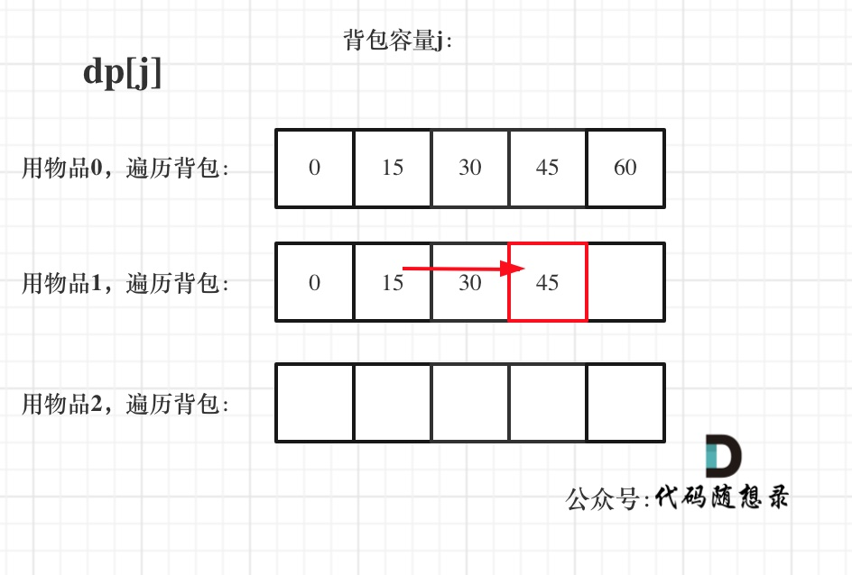

**卡码网（52）：**

###### 题目描述

小明是一位科学家，他需要参加一场重要的国际科学大会，以展示自己的最新研究成果。他需要带一些研究材料，但是他的行李箱空间有限。这些研究材料包括实验设备、文献资料和实验样本等等，它们各自占据不同的重量，并且具有不同的价值。

小明的行李箱所能承担的总重量为 N，问小明应该如何抉择，才能携带最大价值的研究材料，每种研究材料可以选择无数次，并且可以重复选择。

###### 输入描述

第一行包含两个整数，N，V，分别表示研究材料的种类和行李空间 

接下来包含 N 行，每行两个整数 wi 和 vi，代表第 i 种研究材料的重量和价值

###### 输出描述

输出一个整数，表示最大价值。

###### 输入示例

```
4 5
1 2
2 4
3 4
4 5
```

###### 输出示例

```
10
```

###### 提示信息

第一种材料选择五次，可以达到最大值。

数据范围：

1 <= N <= 10000;
1 <= V <= 10000;
1 <= wi, vi <= 10^9^.


### 完全背包

有N件物品和一个最多能背重量为W的背包。第i件物品的重量是weight[i]，得到的价值是value[i] 。**每件物品都有无限个（也就是可以放入背包多次）**，求解将哪些物品装入背包里物品价值总和最大。

**完全背包和01背包问题唯一不同的地方就是，每种物品有无限件**。

同样leetcode上没有纯完全背包问题，都是需要完全背包的各种应用，需要转化成完全背包问题，所以我这里还是以纯完全背包问题进行讲解理论和原理。

在下面的讲解中，我依然举这个例子：

背包最大重量为4。

物品为：

|       | 重量 | 价值 |
| ----- | ---- | ---- |
| 物品0 | 1    | 15   |
| 物品1 | 3    | 20   |
| 物品2 | 4    | 30   |

**每件商品都有无限个！**

问背包能背的物品最大价值是多少？

01背包和完全背包唯一不同就是体现在遍历顺序上，所以本文就不去做动规五部曲了，我们直接针对遍历顺序经行分析！

首先再回顾一下01背包的核心代码

```cpp
for(int i = 0; i < weight.size(); i++) { // 遍历物品
    for(int j = bagWeight; j >= weight[i]; j--) { // 遍历背包容量
        dp[j] = max(dp[j], dp[j - weight[i]] + value[i]);
    }
}
```

我们知道01背包内嵌的循环是从大到小遍历，为了保证每个物品仅被添加一次。

而完全背包的物品是可以添加多次的，所以要从小到大去遍历，即：

```cpp
// 先遍历物品，再遍历背包
for(int i = 0; i < weight.size(); i++) { // 遍历物品
    for(int j = weight[i]; j <= bagWeight ; j++) { // 遍历背包容量
        dp[j] = max(dp[j], dp[j - weight[i]] + value[i]);

    }
}
```

dp状态图如下：


相信很多同学看网上的文章，关于完全背包介绍基本就到为止了。

**其实还有一个很重要的问题，为什么遍历物品在外层循环，遍历背包容量在内层循环？**

这个问题很多题解关于这里都是轻描淡写就略过了，大家都默认 遍历物品在外层，遍历背包容量在内层，好像本应该如此一样，那么为什么呢？

难道就不能遍历背包容量在外层，遍历物品在内层？

看过这两篇的话：

- [动态规划：关于01背包问题，你该了解这些！](https://programmercarl.com/背包理论基础01背包-1.html)
- [动态规划：关于01背包问题，你该了解这些！（滚动数组）](https://programmercarl.com/背包理论基础01背包-2.html)

就知道了，01背包中二维dp数组的两个for遍历的先后循序是可以颠倒了，一维dp数组的两个for循环先后循序一定是先遍历物品，再遍历背包容量。

**在完全背包中，对于一维dp数组来说，其实两个for循环嵌套顺序是无所谓的！**

因为dp[j] 是根据 下标j之前所对应的dp[j]计算出来的。 只要保证下标j之前的dp[j]都是经过计算的就可以了。

遍历物品在外层循环，遍历背包容量在内层循环，状态如图：



遍历背包容量在外层循环，遍历物品在内层循环，状态如图：


看了这两个图，大家就会理解，完全背包中，两个for循环的先后循序，都不影响计算dp[j]所需要的值（这个值就是下标j之前所对应的dp[j]）。

先遍历背包在遍历物品，代码如下：

```cpp
// 先遍历背包，再遍历物品
for(int j = 0; j <= bagWeight; j++) { // 遍历背包容量
    for(int i = 0; i < weight.size(); i++) { // 遍历物品
        if (j - weight[i] >= 0) dp[j] = max(dp[j], dp[j - weight[i]] + value[i]);
    }
    cout << endl;
}
```

完整的C++测试代码如下：

```cpp
// 先遍历物品，在遍历背包
void test_CompletePack() {
    vector<int> weight = {1, 3, 4};
    vector<int> value = {15, 20, 30};
    int bagWeight = 4;
    vector<int> dp(bagWeight + 1, 0);
    for(int i = 0; i < weight.size(); i++) { // 遍历物品
        for(int j = weight[i]; j <= bagWeight; j++) { // 遍历背包容量
            dp[j] = max(dp[j], dp[j - weight[i]] + value[i]);
        }
    }
    cout << dp[bagWeight] << endl;
}
int main() {
    test_CompletePack();
}
```

```cpp
// 先遍历背包，再遍历物品
void test_CompletePack() {
    vector<int> weight = {1, 3, 4};
    vector<int> value = {15, 20, 30};
    int bagWeight = 4;

    vector<int> dp(bagWeight + 1, 0);

    for(int j = 0; j <= bagWeight; j++) { // 遍历背包容量
        for(int i = 0; i < weight.size(); i++) { // 遍历物品
            if (j - weight[i] >= 0) dp[j] = max(dp[j], dp[j - weight[i]] + value[i]);
        }
    }
    cout << dp[bagWeight] << endl;
}
int main() {
    test_CompletePack();
}

```

卡码网题目代码：

```cpp
#include <iostream>
#include <vector>
using namespace std;

// 先遍历背包，再遍历物品
void test_CompletePack(vector<int> weight, vector<int> value, int bagWeight) {

    vector<int> dp(bagWeight + 1, 0);

    for(int j = 0; j <= bagWeight; j++) { // 遍历背包容量
        for(int i = 0; i < weight.size(); i++) { // 遍历物品
            if (j - weight[i] >= 0) dp[j] = max(dp[j], dp[j - weight[i]] + value[i]);
        }
    }
    cout << dp[bagWeight] << endl;
}
int main() {
    int N, V;
    cin >> N >> V;
    vector<int> weight;
    vector<int> value;
    for (int i = 0; i < N; i++) {
        int w;
        int v;
        cin >> w >> v;
        weight.push_back(w);
        value.push_back(v);
    }
    test_CompletePack(weight, value, V);
    return 0;
}
```

## 总结

细心的同学可能发现，**全文我说的都是对于纯完全背包问题，其for循环的先后循环是可以颠倒的！**

但如果题目稍稍有点变化，就会体现在遍历顺序上。

如果问装满背包有几种方式的话？ 那么两个for循环的先后顺序就有很大区别了，而leetcode上的题目都是这种稍有变化的类型。

这个区别，我将在后面讲解具体leetcode题目中给大家介绍，因为这块如果不结合具题目，单纯的介绍原理估计很多同学会越看越懵！

别急，下一篇就是了！

最后，**又可以出一道面试题了，就是纯完全背包，要求先用二维dp数组实现，然后再用一维dp数组实现，最后再问，两个for循环的先后是否可以颠倒？为什么？** 这个简单的完全背包问题，估计就可以难住不少候选人了。