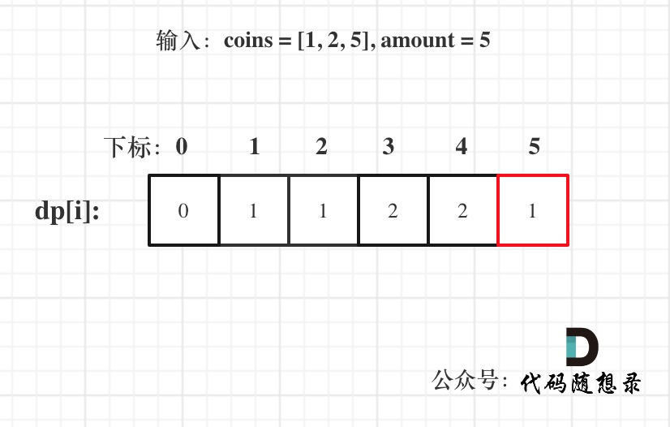

**力扣（322）：**

给你一个整数数组 `coins` ，表示不同面额的硬币；以及一个整数 `amount` ，表示总金额。

计算并返回可以凑成总金额所需的 **最少的硬币个数** 。如果没有任何一种硬币组合能组成总金额，返回 `-1` 。

你可以认为每种硬币的数量是无限的。

**示例 1：**

```
输入：coins = [1, 2, 5], amount = 11
输出：3 
解释：11 = 5 + 5 + 1
```

**示例 2：**

```
输入：coins = [2], amount = 3
输出：-1
```

**示例 3：**

```
输入：coins = [1], amount = 0
输出：0
```

**提示：**

- `1 <= coins.length <= 12`
- `1 <= coins[i] <= 2^31 - 1`
- `0 <= amount <= 10^4`


在[动态规划：518.零钱兑换II ](https://programmercarl.com/0518.零钱兑换II.html)中我们已经兑换一次零钱了，这次又要兑换，套路不一样！

题目中说每种硬币的数量是无限的，可以看出是典型的完全背包问题。

动规五部曲分析如下：

1.确定dp数组以及下标的含义

**dp[j]：凑足总额为j所需钱币的最少个数为dp[j]**

2.确定递推公式

凑足总额为j - coins[i]的最少个数为dp[j - coins[i]]，那么只需要加上一个钱币coins[i]即dp[j - coins[i]] + 1就是dp[j]（考虑coins[i]）

所以dp[j] 要取所有 dp[j - coins[i]] + 1 中最小的。

递推公式：dp[j] = min(dp[j - coins[i]] + 1, dp[j]);

3.dp数组如何初始化

首先凑足总金额为0所需钱币的个数一定是0，那么dp[0] = 0;

其他下标对应的数值呢？

考虑到递推公式的特性，dp[j]必须初始化为一个最大的数，否则就会在min(dp[j - coins[i]] + 1, dp[j])比较的过程中被初始值覆盖。

所以下标非0的元素都是应该是最大值。

代码如下：

```text
vector<int> dp(amount + 1, INT_MAX);
dp[0] = 0;
```

4.确定遍历顺序

本题求钱币最小个数，**那么钱币有顺序和没有顺序都可以，都不影响钱币的最小个数**。

所以本题并不强调集合是组合还是排列。

**如果求组合数就是外层for循环遍历物品，内层for遍历背包**。

**如果求排列数就是外层for遍历背包，内层for循环遍历物品**。

**所以本题的两个for循环的关系是：外层for循环遍历物品，内层for遍历背包或者外层for遍历背包，内层for循环遍历物品都是可以的！**

那么我采用coins放在外循环，target在内循环的方式。

本题钱币数量可以无限使用，那么是完全背包。所以遍历的内循环是正序

综上所述，遍历顺序为：coins（物品）放在外循环，target（背包）在内循环。且内循环正序。

5.举例推导dp数组

以输入：coins = [1, 2, 5], amount = 5为例



dp[amount]为最终结果。

以上分析完毕，C++ 代码如下：

```cpp
// 版本一
class Solution {
public:
    int coinChange(vector<int>& coins, int amount) {
        vector<int> dp(amount + 1, INT_MAX);
        dp[0] = 0;
        for (int i = 0; i < coins.size(); i++) { // 遍历物品
            for (int j = coins[i]; j <= amount; j++) { // 遍历背包
                if (dp[j - coins[i]] != INT_MAX) { // 如果dp[j - coins[i]]是初始值则跳过
                    dp[j] = min(dp[j - coins[i]] + 1, dp[j]);
                }
            }
        }
        if (dp[amount] == INT_MAX) return -1;
        return dp[amount];
    }
};
```

- 时间复杂度: O(n * amount)，其中 n 为 coins 的长度
- 空间复杂度: O(amount)

对于遍历方式遍历背包放在外循环，遍历物品放在内循环也是可以的，我就直接给出代码了

```cpp
// 版本二
class Solution {
public:
    int coinChange(vector<int>& coins, int amount) {
        vector<int> dp(amount + 1, INT_MAX);
        dp[0] = 0;
        for (int i = 1; i <= amount; i++) {  // 遍历背包
            for (int j = 0; j < coins.size(); j++) { // 遍历物品
                if (i - coins[j] >= 0 && dp[i - coins[j]] != INT_MAX ) {
                    dp[i] = min(dp[i - coins[j]] + 1, dp[i]);
                }
            }
        }
        if (dp[amount] == INT_MAX) return -1;
        return dp[amount];
    }
};
```