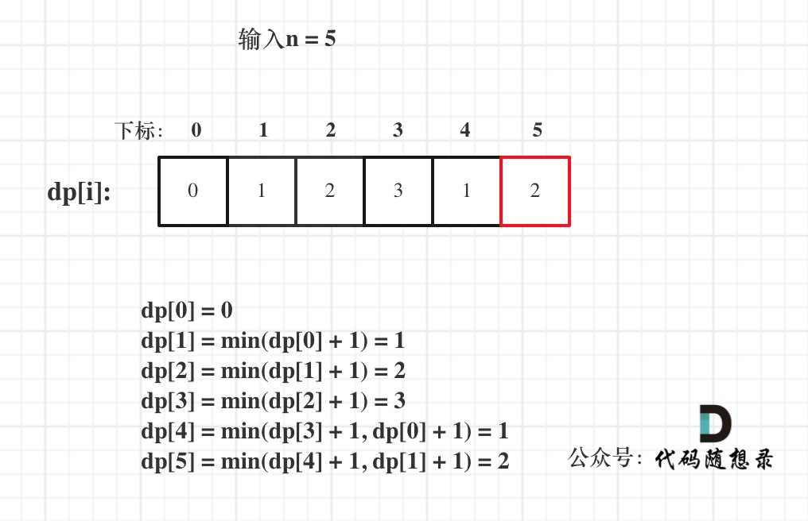

**力扣（279）：**

给你一个整数 `n` ，返回 *和为 `n` 的完全平方数的最少数量* 。

**完全平方数** 是一个整数，其值等于另一个整数的平方；换句话说，其值等于一个整数自乘的积。例如，`1`、`4`、`9` 和 `16` 都是完全平方数，而 `3` 和 `11` 不是。

**示例 1：**

```
输入：n = 12
输出：3 
解释：12 = 4 + 4 + 4
```

**示例 2：**

```
输入：n = 13
输出：2
解释：13 = 4 + 9
```

**提示：**

- `1 <= n <= 10^4`


自己写的：

```cpp
class Solution {
public:
    int numSquares(int n) {
        vector<int> nums;
        for (int i = 1; i <= n; ++i) {
            int tmp = sqrt(i);
            if (tmp * tmp == i)
                nums.push_back(i);
        }

        vector<int> dp(n + 1, INT_MAX);
        dp[0] = 0;
        for (int i = 0; i < nums.size(); ++i) {
            for (int j = nums[i]; j <= n; ++j) {
                if (dp[j - nums[i]] != INT_MAX)
                    dp[j] = min(dp[j], dp[j - nums[i]] + 1);
            }
        }

        return dp[n];
    }
};
```

有点get到动态规划的精妙了


教学的：

可能刚看这种题感觉没啥思路，又平方和的，又最小数的。

**我来把题目翻译一下：完全平方数就是物品（可以无限件使用），凑个正整数n就是背包，问凑满这个背包最少有多少物品？**

感受出来了没，这么浓厚的完全背包氛围，而且和昨天的题目[动态规划：322. 零钱兑换 ](https://programmercarl.com/0322.零钱兑换.html)就是一样一样的！

动规五部曲分析如下：

1.确定dp数组（dp table）以及下标的含义

**dp[j]：和为j的完全平方数的最少数量为dp[j]**

2.确定递推公式

dp[j] 可以由dp[j - i * i]推出， dp[j - i * i] + 1 便可以凑成dp[j]。

此时我们要选择最小的dp[j]，所以递推公式：dp[j] = min(dp[j - i * i] + 1, dp[j]);

3.dp数组如何初始化

dp[0]表示 和为0的完全平方数的最小数量，那么dp[0]一定是0。

有同学问题，那0 * 0 也算是一种啊，为啥dp[0] 就是 0呢？

看题目描述，找到若干个完全平方数（比如 1, 4, 9, 16, ...），题目描述中可没说要从0开始，dp[0]=0完全是为了递推公式。

非0下标的dp[j]应该是多少呢？

从递归公式dp[j] = min(dp[j - i * i] + 1, dp[j]);中可以看出每次dp[j]都要选最小的，**所以非0下标的dp[j]一定要初始为最大值，这样dp[j]在递推的时候才不会被初始值覆盖**。

4.确定遍历顺序

我们知道这是完全背包，

如果求组合数就是外层for循环遍历物品，内层for遍历背包。

如果求排列数就是外层for遍历背包，内层for循环遍历物品。

在[动态规划：322. 零钱兑换 ](https://programmercarl.com/0322.零钱兑换.html)中我们就深入探讨了这个问题，本题也是一样的，是求最小数！

**所以本题外层for遍历背包，内层for遍历物品，还是外层for遍历物品，内层for遍历背包，都是可以的！**

我这里先给出外层遍历背包，内层遍历物品的代码：

```cpp
vector<int> dp(n + 1, INT_MAX);
dp[0] = 0;
for (int i = 0; i <= n; i++) { // 遍历背包
    for (int j = 1; j * j <= i; j++) { // 遍历物品
        dp[i] = min(dp[i - j * j] + 1, dp[i]);
    }
}
```

5.举例推导dp数组

已输入n为5例，dp状态图如下：



dp[0] = 0 dp[1] = min(dp[0] + 1) = 1 dp[2] = min(dp[1] + 1) = 2 dp[3] = min(dp[2] + 1) = 3 dp[4] = min(dp[3] + 1, dp[0] + 1) = 1 dp[5] = min(dp[4] + 1, dp[1] + 1) = 2

最后的dp[n]为最终结果。

以上动规五部曲分析完毕C++代码如下：

```cpp
// 版本一
class Solution {
public:
    int numSquares(int n) {
        vector<int> dp(n + 1, INT_MAX);
        dp[0] = 0;
        for (int i = 0; i <= n; i++) { // 遍历背包
            for (int j = 1; j * j <= i; j++) { // 遍历物品
                dp[i] = min(dp[i - j * j] + 1, dp[i]);
            }
        }
        return dp[n];
    }
};
```

- 时间复杂度: O(n * √n)
- 空间复杂度: O(n)

同样我在给出先遍历物品，在遍历背包的代码，一样的可以AC的。

```cpp
// 版本二
class Solution {
public:
    int numSquares(int n) {
        vector<int> dp(n + 1, INT_MAX);
        dp[0] = 0;
        for (int i = 1; i * i <= n; i++) { // 遍历物品
            for (int j = i * i; j <= n; j++) { // 遍历背包
                dp[j] = min(dp[j - i * i] + 1, dp[j]);
            }
        }
        return dp[n];
    }
};
```

- 同上