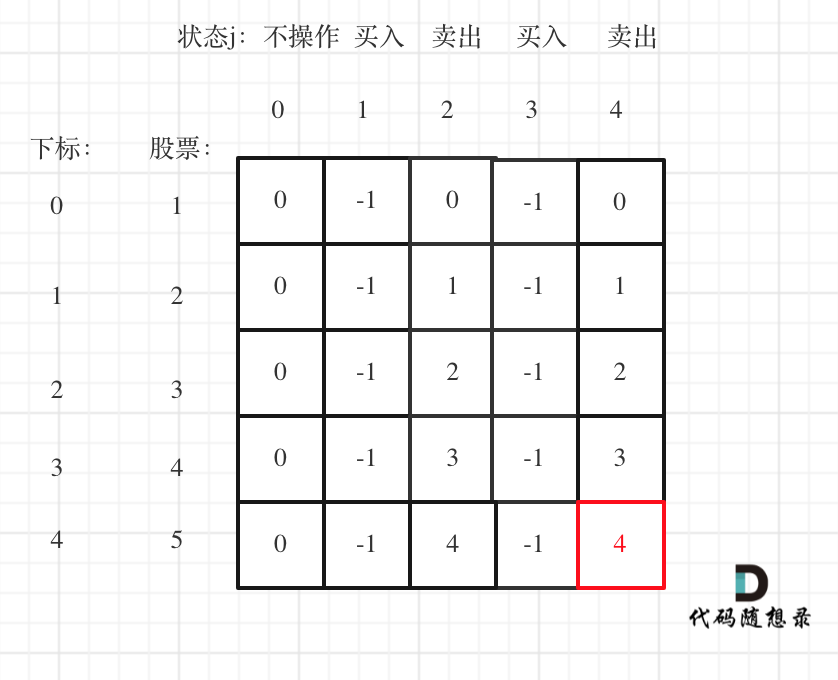

**力扣（188）：**

给你一个整数数组 `prices` 和一个整数 `k` ，其中 `prices[i]` 是某支给定的股票在第 `i` 天的价格。

设计一个算法来计算你所能获取的最大利润。你最多可以完成 `k` 笔交易。也就是说，你最多可以买 `k` 次，卖 `k` 次。

**注意：**你不能同时参与多笔交易（你必须在再次购买前出售掉之前的股票）。

**示例 1：**

```
输入：k = 2, prices = [2,4,1]
输出：2
解释：在第 1 天 (股票价格 = 2) 的时候买入，在第 2 天 (股票价格 = 4) 的时候卖出，这笔交易所能获得利润 = 4-2 = 2 。
```

**示例 2：**

```
输入：k = 2, prices = [3,2,6,5,0,3]
输出：7
解释：在第 2 天 (股票价格 = 2) 的时候买入，在第 3 天 (股票价格 = 6) 的时候卖出, 这笔交易所能获得利润 = 6-2 = 4 。
     随后，在第 5 天 (股票价格 = 0) 的时候买入，在第 6 天 (股票价格 = 3) 的时候卖出, 这笔交易所能获得利润 = 3-0 = 3 。
```

**提示：**

- `1 <= k <= 100`
- `1 <= prices.length <= 1000`
- `0 <= prices[i] <= 1000`


自己写的：

```cpp
class Solution {
public:
    int maxProfit(int k, vector<int>& prices) {
        vector<vector<int>> dp(prices.size(), vector<int>(2 * k + 1, 0));
        for (int i = 1; i <= 2 * k - 1; i += 2) {
            dp[0][i] = -prices[0];
        }

        for (int i = 1; i < prices.size(); ++i) {
            for (int j = 1; j < 2 * k; j += 2) {
                if (j == 1) {
                    dp[i][j] = max(dp[i - 1][j], 0 - prices[i]);
                    dp[i][j + 1] = max(dp[i - 1][j + 1], dp[i - 1][j] + prices[i]);
                }
                else {
                    dp[i][j] = max(dp[i - 1][j], dp[i - 1][j - 1] - prices[i]);
                    dp[i][j + 1] = max(dp[i - 1][j + 1], dp[i - 1][j] + prices[i]);
                }

            }
        }

        return dp[prices.size() - 1][2 * k];
    }
};
```

说实话还不是完全理解，这只是仿照上一题的思路写出来的。还要再好好思考（主要是递推公式还有点不理解）


教学的：

这道题目可以说是[动态规划：123.买卖股票的最佳时机III ](https://programmercarl.com/0123.买卖股票的最佳时机III.html)的进阶版，这里要求至多有k次交易。

动规五部曲，分析如下：

1.确定dp数组以及下标的含义

在[动态规划：123.买卖股票的最佳时机III中，我是定义了一个二维dp数组，本题其实依然可以用一个二维dp数组。

使用二维数组 `dp[i][j] `：第i天的状态为j，所剩下的最大现金是`dp[i][j]`

j的状态表示为：

- 0 表示不操作
- 1 第一次买入
- 2 第一次卖出
- 3 第二次买入
- 4 第二次卖出
- .....

**大家应该发现规律了吧 ，除了0以外，偶数就是卖出，奇数就是买入**。

题目要求是至多有K笔交易，那么j的范围就定义为 2 * k + 1 就可以了。

所以二维dp数组的C++定义为：

```cpp
vector<vector<int>> dp(prices.size(), vector<int>(2 * k + 1, 0));
```

2.确定递推公式

还要强调一下：`dp[i][1]`，**表示的是第i天，买入股票的状态，并不是说一定要第i天买入股票，这是很多同学容易陷入的误区**。

达到`dp[i`][1]状态，有两个具体操作：

- 操作一：第i天买入股票了，那么`dp[i][1] = dp[i - 1][0] - prices[i]`
- 操作二：第i天没有操作，而是沿用前一天买入的状态，即：`dp[i][1] = dp[i - 1][1]`

选最大的，所以 `dp[i][1] = max(dp[i - 1][0] - prices[i], dp[i - 1][1])`;

同理`dp[i][2]`也有两个操作：

- 操作一：第i天卖出股票了，那么`dp[i][2] = dp[i - 1][1] + prices[i]`
- 操作二：第i天没有操作，沿用前一天卖出股票的状态，即：`dp[i][2] = dp[i - 1`][2]

所以`dp[i][2] = max(dp[i - 1][1] + prices[i], dp[i - 1][2])`

同理可以类比剩下的状态，代码如下：

```cpp
for (int j = 0; j < 2 * k - 1; j += 2) {
    dp[i][j + 1] = max(dp[i - 1][j + 1], dp[i - 1][j] - prices[i]);
    dp[i][j + 2] = max(dp[i - 1][j + 2], dp[i - 1][j + 1] + prices[i]);
}
```

**本题和[动态规划：123.买卖股票的最佳时机III ](https://programmercarl.com/0123.买卖股票的最佳时机III.html)最大的区别就是这里要类比j为奇数是买，偶数是卖的状态**。

3.dp数组如何初始化

第0天没有操作，这个最容易想到，就是0，即：`dp[0][0] = 0`;

第0天做第一次买入的操作，`dp[0][1] = -prices[0]`;

第0天做第一次卖出的操作，这个初始值应该是多少呢？

此时还没有买入，怎么就卖出呢？ 其实大家可以理解当天买入，当天卖出，所以`dp[0][2] = 0`;

第0天第二次买入操作，初始值应该是多少呢？应该不少同学疑惑，第一次还没买入呢，怎么初始化第二次买入呢？

第二次买入依赖于第一次卖出的状态，其实相当于第0天第一次买入了，第一次卖出了，然后在买入一次（第二次买入），那么现在手头上没有现金，只要买入，现金就做相应的减少。

所以第二次买入操作，初始化为：`dp[0][3] = -prices[0]`;

第二次卖出初始化`dp[0][4] = 0`;

**所以同理可以推出`dp[0][j]`当j为奇数的时候都初始化为 -prices[0]**

代码如下：

```cpp
for (int j = 1; j < 2 * k; j += 2) {
    dp[0][j] = -prices[0];
}
```

**在初始化的地方同样要类比j为偶数是卖、奇数是买的状态**。

4.确定遍历顺序

从递归公式其实已经可以看出，一定是从前向后遍历，因为dp[i]，依靠dp[i - 1]的数值。

5.举例推导dp数组

以输入[1,2,3,4,5]，k=2为例。



最后一次卖出，一定是利润最大的，dp[prices.size() - 1][2 * k]即红色部分就是最后求解。

以上分析完毕，C++代码如下：

```cpp
class Solution {
public:
    int maxProfit(int k, vector<int>& prices) {

        if (prices.size() == 0) return 0;
        vector<vector<int>> dp(prices.size(), vector<int>(2 * k + 1, 0));
        for (int j = 1; j < 2 * k; j += 2) {
            dp[0][j] = -prices[0];
        }
        for (int i = 1;i < prices.size(); i++) {
            for (int j = 0; j < 2 * k - 1; j += 2) {
                dp[i][j + 1] = max(dp[i - 1][j + 1], dp[i - 1][j] - prices[i]);
                dp[i][j + 2] = max(dp[i - 1][j + 2], dp[i - 1][j + 1] + prices[i]);
            }
        }
        return dp[prices.size() - 1][2 * k];
    }
};
```

- 时间复杂度: O(n * k)，其中 n 为 prices 的长度
- 空间复杂度: O(n * k)

当然有的解法是定义一个三维数组`dp[i][j][k]`，第i天，第j次买卖，k表示买还是卖的状态，从定义上来讲是比较直观。

但感觉三维数组操作起来有些麻烦，我是直接用二维数组来模拟三维数组的情况，代码看起来也清爽一些。