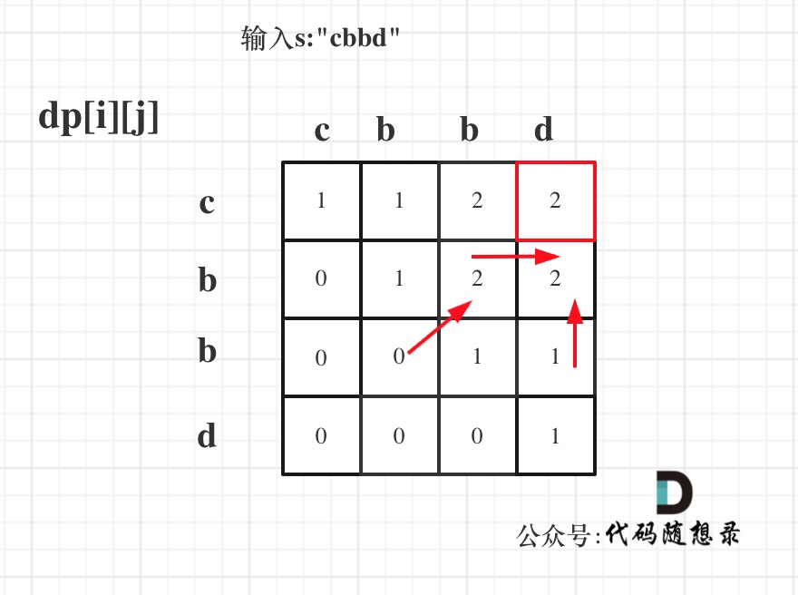

**力扣（516）：**

给你一个字符串 `s` ，找出其中最长的回文子序列，并返回该序列的长度。

子序列定义为：不改变剩余字符顺序的情况下，删除某些字符或者不删除任何字符形成的一个序列。

**示例 1：**

```
输入：s = "bbbab"
输出：4
解释：一个可能的最长回文子序列为 "bbbb" 。
```

**示例 2：**

```
输入：s = "cbbd"
输出：2
解释：一个可能的最长回文子序列为 "bb" 。
```

**提示**

- `1 <= s.length <= 1000`
- `s` 仅由小写英文字母组成


自己写的：

```cpp
class Solution {
public:
    int longestPalindromeSubseq(string s) {
        if (s.size() == 1)
            return 1;

        vector<vector<int>> dp(s.size(), vector<int>(s.size(), 0));
        for (int i = s.size() - 1; i >= 0; --i) {
            for (int j = i; j < s.size(); ++j) {
                if (s[i] == s[j]) {
                    if (i == j)
                        dp[i][j] = 1;
                    else
                        dp[i][j] = dp[i + 1][j - 1] + 2;
                }
                else
                    dp[i][j] = max(dp[i + 1][j], dp[i][j - 1]);
            }
        }

        return dp[0][s.size() - 1];
    }
};
```

这是刚看了一眼教学里对dp数组的定义后才写出来的，所以五步骤真的很重要


刚刚做过了 [动态规划：回文子串 ](https://programmercarl.com/0647.回文子串.html)，求的是回文子串，而本题要求的是回文子序列， 要搞清楚这两者之间的区别。

**回文子串是要连续的，回文子序列可不是连续的！** 回文子串，回文子序列都是动态规划经典题目。

回文子串，可以做这两题：

- 647.回文子串
- 5.最长回文子串

思路其实是差不多的，但本题要比求回文子串简单一点，因为情况少了一点。

动规五部曲分析如下：

1.确定dp数组（dp table）以及下标的含义

**`dp[i][j]`：字符串s在[i, j]范围内最长的回文子序列的长度为`dp[i][j]`**。

2.确定递推公式

在判断回文子串的题目中，关键逻辑就是看s[i]与s[j]是否相同。

如果s[i]与s[j]相同，那么`dp[i][j] = dp[i + 1][j - 1] + 2`;

如图：


如果s[i]与s[j]不相同，说明s[i]和s[j]的同时加入 并不能增加[i,j]区间回文子序列的长度，那么分别加入s[i]、s[j]看看哪一个可以组成最长的回文子序列。

加入s[j]的回文子序列长度为`dp[i + 1][j]`。

加入s[i]的回文子序列长度为`dp[i][j - 1]`。

那么`dp[i][j]`一定是取最大的，即：`dp[i][j] = max(dp[i + 1][j], dp[i][j - 1])`;


代码如下：

```cpp
if (s[i] == s[j]) {
    dp[i][j] = dp[i + 1][j - 1] + 2;
} else {
    dp[i][j] = max(dp[i + 1][j], dp[i][j - 1]);
}
```

3.dp数组如何初始化

首先要考虑当i 和j 相同的情况，从递推公式：`dp[i][j] = dp[i + 1][j - 1] + 2`; 可以看出 递推公式是计算不到 i 和j相同时候的情况。

所以需要手动初始化一下，当i与j相同，那么`dp[i][j]`一定是等于1的，即：一个字符的回文子序列长度就是1。

其他情况`dp[i][j]`初始为0就行，这样递推公式：`dp[i][j] = max(dp[i + 1][j], dp[i][j - 1])`; 中`dp[i][j]`才不会被初始值覆盖。

```cpp
vector<vector<int>> dp(s.size(), vector<int>(s.size(), 0));
for (int i = 0; i < s.size(); i++) dp[i][i] = 1;
```

4.确定遍历顺序

从递归公式中，可以看出，`dp[i][j] `依赖于 `dp[i + 1][j - 1] `，`dp[i + 1][j] `和 `dp[i][j - 1]`，如图：


**所以遍历i的时候一定要从下到上遍历，这样才能保证下一行的数据是经过计算的**。

j的话，可以正常从左向右遍历。

代码如下：

```cpp
for (int i = s.size() - 1; i >= 0; i--) {
    for (int j = i + 1; j < s.size(); j++) {
        if (s[i] == s[j]) {
            dp[i][j] = dp[i + 1][j - 1] + 2;
        } else {
            dp[i][j] = max(dp[i + 1][j], dp[i][j - 1]);
        }
    }
}
```

5.举例推导dp数组

输入s:"cbbd" 为例，dp数组状态如图：



红色框即：`dp[0][s.size() - 1]`; 为最终结果。

以上分析完毕，C++代码如下：

```cpp
class Solution {
public:
    int longestPalindromeSubseq(string s) {
        vector<vector<int>> dp(s.size(), vector<int>(s.size(), 0));
        for (int i = 0; i < s.size(); i++) dp[i][i] = 1;
        for (int i = s.size() - 1; i >= 0; i--) {
            for (int j = i + 1; j < s.size(); j++) {
                if (s[i] == s[j]) {
                    dp[i][j] = dp[i + 1][j - 1] + 2;
                } else {
                    dp[i][j] = max(dp[i + 1][j], dp[i][j - 1]);
                }
            }
        }
        return dp[0][s.size() - 1];
    }
};
```

- 时间复杂度: O(n^2)
- 空间复杂度: O(n^2)

##  


动态规划结束啦